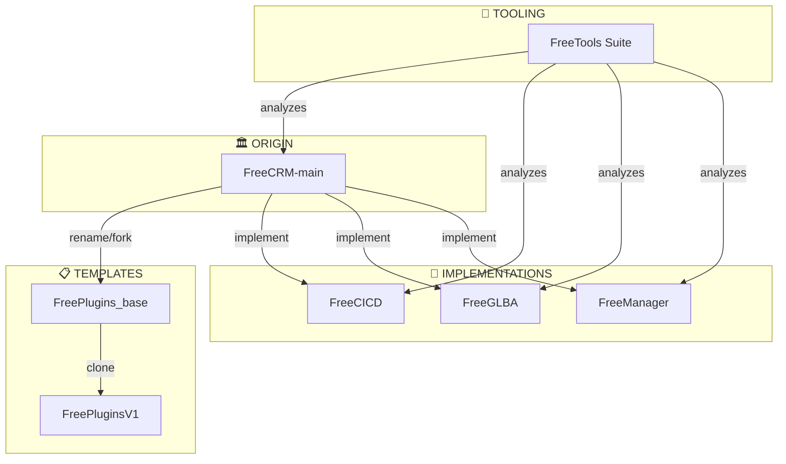
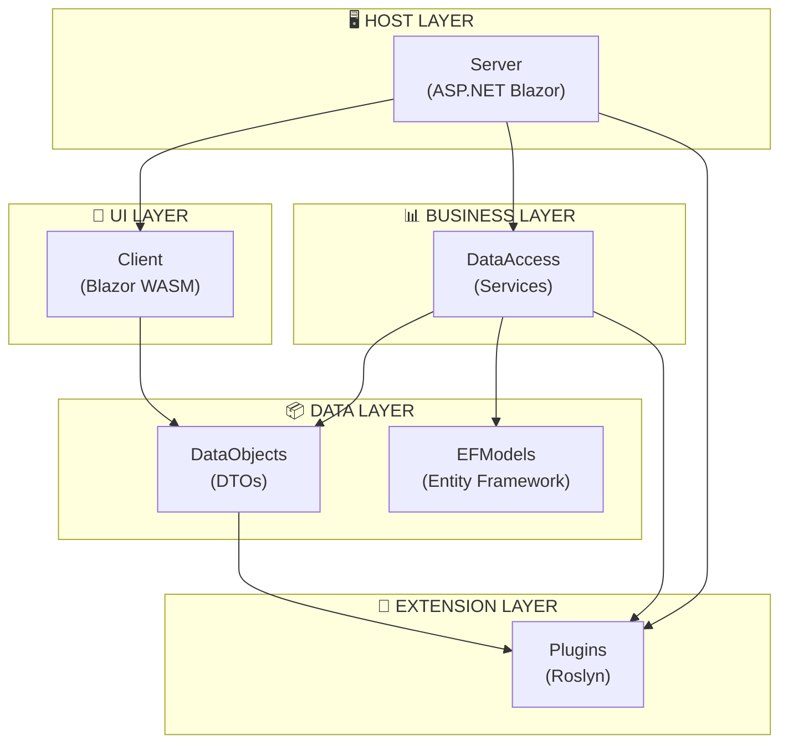
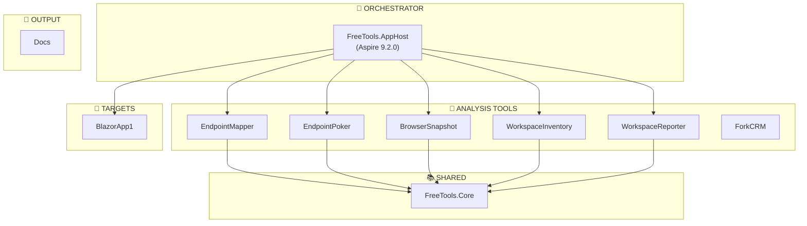
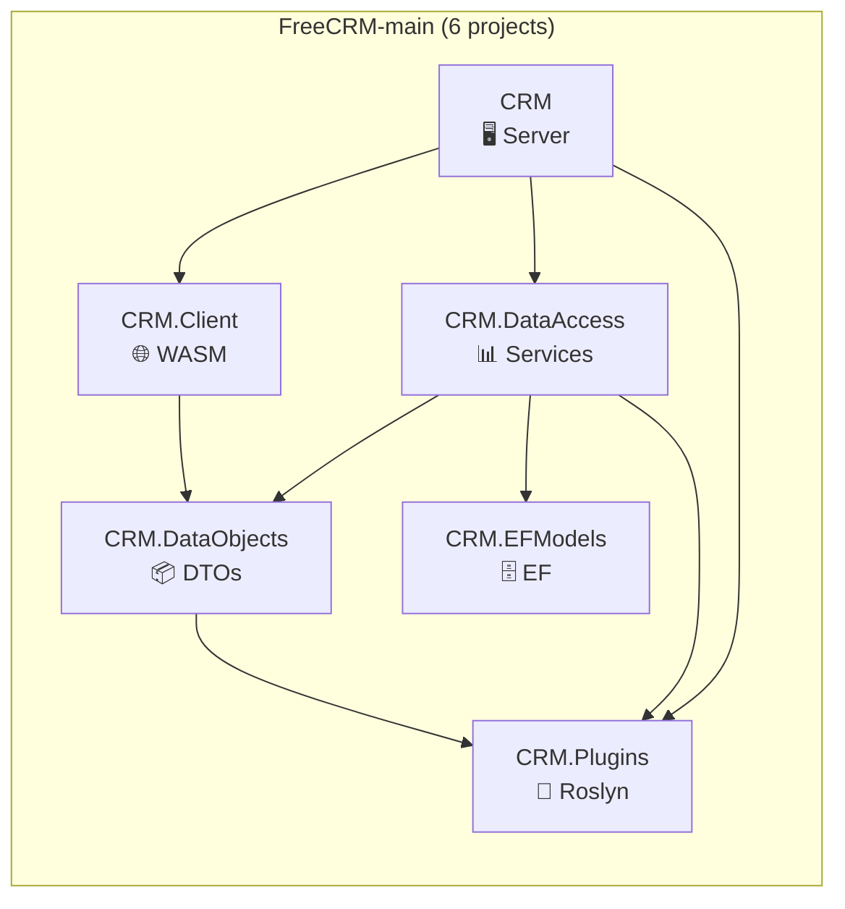
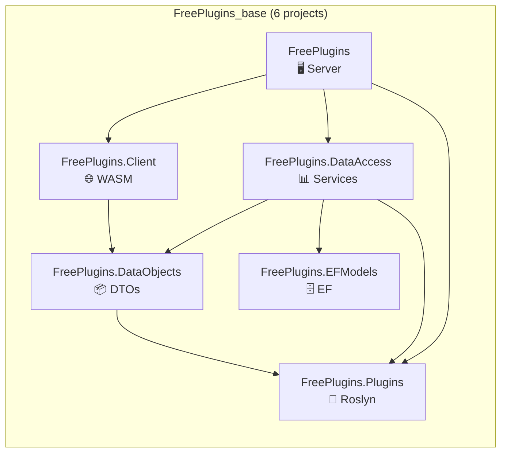
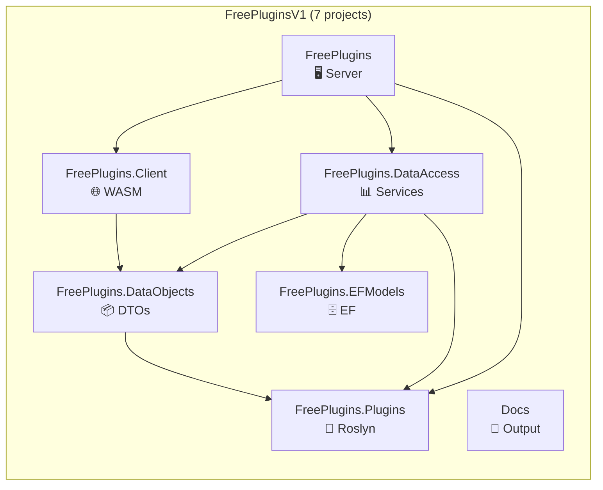
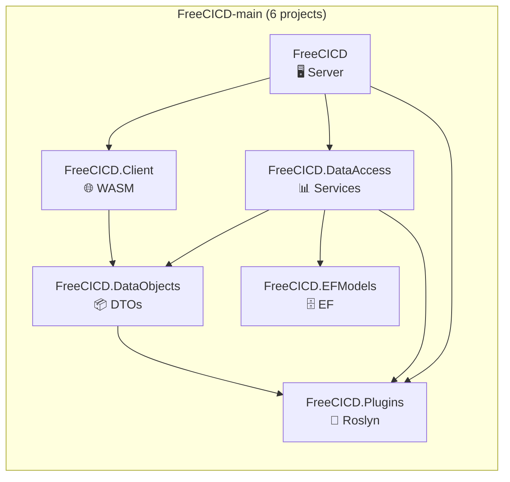
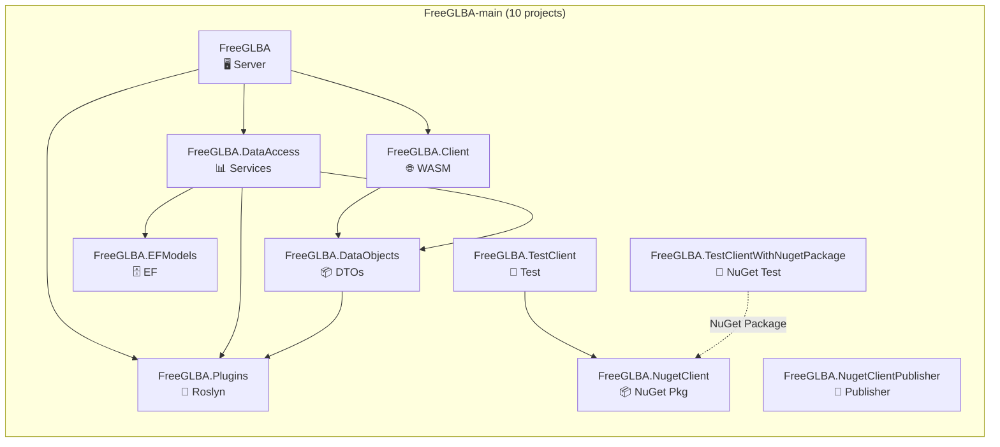
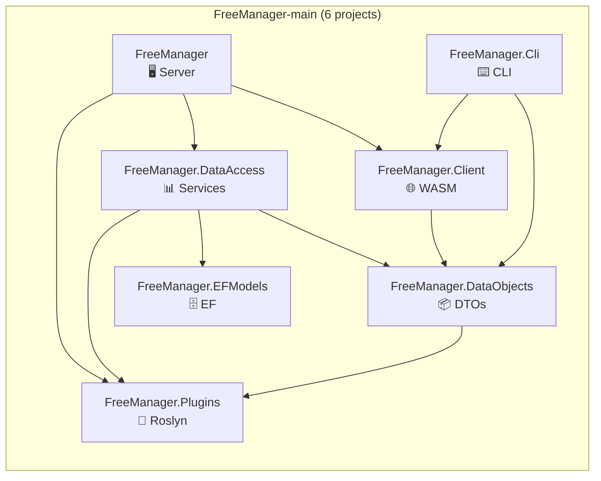
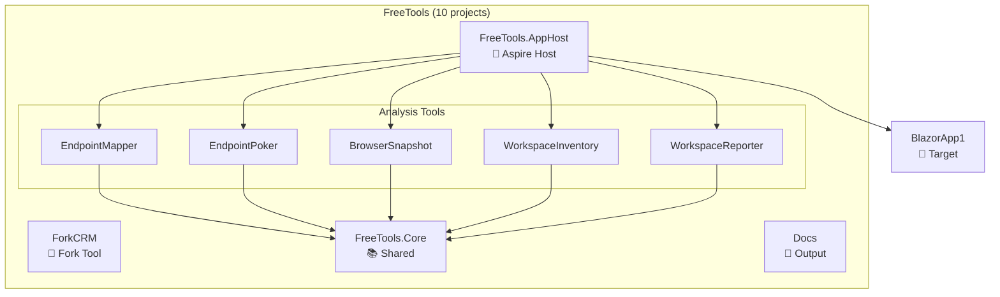

# Project Dependency Map

> **Purpose:** Complete dependency mapping for all 51 projects across 7 project suites  
> **Version:** 1.0  
> **Last Updated:** 2025-01-XX  
> **Total Projects:** 51

---

## Table of Contents

1. [Suite Overview](#suite-overview)
2. [Dependency Graph (Mermaid)](#dependency-graph)
3. [Complete Project Table](#complete-project-table)
4. [Suite-by-Suite Breakdown](#suite-by-suite-breakdown)
5. [Dependency Depth Analysis](#dependency-depth-analysis)
6. [Package Version Comparison](#package-version-comparison)

---

## Suite Overview

| # | Suite | Location | Projects | Purpose | Status |
|---|-------|----------|----------|---------|--------|
| 1 | **FreeCRM-main** | `FreeCRM-main/` | 6 | Base framework (origin) | ✅ Active |
| 2 | **FreePlugins_base** | `FreeCRM-FreePlugins_base/` | 6 | Renamed template | 📋 Template |
| 3 | **FreePluginsV1** | `FreePluginsV1/` | 7 | Development clone | 🔨 WIP |
| 4 | **FreeCICD** | `FreeCICD-main/` | 6 | CI/CD implementation | ✅ Active |
| 5 | **FreeGLBA** | `FreeGLBA-main/` | 10 | GLBA compliance (newest) | ✅ Active |
| 6 | **FreeManager** | `FreeManager-main/` | 6 | Management tool (oldest) | ✅ Active |
| 7 | **FreeTools** | `FreeTools/` | 10 | Orchestration/testing suite | ✅ Active |

**Total: 51 projects**

---

## Dependency Graph

### Master Architecture Flow



### Standard 6-Layer Architecture (Per Suite)



### FreeTools Suite Architecture



---

## Complete Project Table

### All 51 Projects with Dependencies

| # | Suite | Project | SDK | Direct Dependencies | Transitive Dependencies |
|---|-------|---------|-----|---------------------|------------------------|
| | | | | | |
| | **FreeCRM-main** | | | | |
| 1 | FreeCRM | CRM | Web | Client, DataAccess, Plugins | DataObjects, EFModels |
| 2 | FreeCRM | CRM.Client | BlazorWebAssembly | DataObjects | Plugins |
| 3 | FreeCRM | CRM.DataAccess | Library | DataObjects, EFModels, Plugins | — |
| 4 | FreeCRM | CRM.DataObjects | Library | Plugins | — |
| 5 | FreeCRM | CRM.EFModels | Library | — | — |
| 6 | FreeCRM | CRM.Plugins | Library | — | — |
| | | | | | |
| | **FreePlugins_base** | | | | |
| 7 | FreePlugins_base | FreePlugins | Web | Client, DataAccess, Plugins | DataObjects, EFModels |
| 8 | FreePlugins_base | FreePlugins.Client | BlazorWebAssembly | DataObjects | Plugins |
| 9 | FreePlugins_base | FreePlugins.DataAccess | Library | DataObjects, EFModels, Plugins | — |
| 10 | FreePlugins_base | FreePlugins.DataObjects | Library | Plugins | — |
| 11 | FreePlugins_base | FreePlugins.EFModels | Library | — | — |
| 12 | FreePlugins_base | FreePlugins.Plugins | Library | — | — |
| | | | | | |
| | **FreePluginsV1** | | | | |
| 13 | FreePluginsV1 | FreePlugins | Web | Client, DataAccess, Plugins | DataObjects, EFModels |
| 14 | FreePluginsV1 | FreePlugins.Client | BlazorWebAssembly | DataObjects | Plugins |
| 15 | FreePluginsV1 | FreePlugins.DataAccess | Library | DataObjects, EFModels, Plugins | — |
| 16 | FreePluginsV1 | FreePlugins.DataObjects | Library | Plugins | — |
| 17 | FreePluginsV1 | FreePlugins.EFModels | Library | — | — |
| 18 | FreePluginsV1 | FreePlugins.Plugins | Library | — | — |
| 19 | FreePluginsV1 | Docs | Library | — | — |
| | | | | | |
| | **FreeCICD** | | | | |
| 20 | FreeCICD | FreeCICD | Web | Client, DataAccess, Plugins | DataObjects, EFModels |
| 21 | FreeCICD | FreeCICD.Client | BlazorWebAssembly | DataObjects | Plugins |
| 22 | FreeCICD | FreeCICD.DataAccess | Library | DataObjects, EFModels, Plugins | — |
| 23 | FreeCICD | FreeCICD.DataObjects | Library | Plugins | — |
| 24 | FreeCICD | FreeCICD.EFModels | Library | — | — |
| 25 | FreeCICD | FreeCICD.Plugins | Library | — | — |
| | | | | | |
| | **FreeGLBA** | | | | |
| 26 | FreeGLBA | FreeGLBA | Web | Client, DataAccess, Plugins | DataObjects, EFModels |
| 27 | FreeGLBA | FreeGLBA.Client | BlazorWebAssembly | DataObjects | Plugins |
| 28 | FreeGLBA | FreeGLBA.DataAccess | Library | DataObjects, EFModels, Plugins | — |
| 29 | FreeGLBA | FreeGLBA.DataObjects | Library | Plugins | — |
| 30 | FreeGLBA | FreeGLBA.EFModels | Library | — | — |
| 31 | FreeGLBA | FreeGLBA.Plugins | Library | — | — |
| 32 | FreeGLBA | FreeGLBA.NugetClient | Library | — | — |
| 33 | FreeGLBA | FreeGLBA.NugetClientPublisher | Exe | — | — |
| 34 | FreeGLBA | FreeGLBA.TestClient | Exe | NugetClient | — |
| 35 | FreeGLBA | FreeGLBA.TestClientWithNugetPackage | Exe | *(NuGet: FreeGLBA.Client)* | — |
| | | | | | |
| | **FreeManager** | | | | |
| 36 | FreeManager | FreeManager | Web | Client, DataAccess, Plugins | DataObjects, EFModels |
| 37 | FreeManager | FreeManager.Client | BlazorWebAssembly | DataObjects | Plugins |
| 38 | FreeManager | FreeManager.DataAccess | Library | DataObjects, EFModels, Plugins | — |
| 39 | FreeManager | FreeManager.DataObjects | Library | Plugins | — |
| 40 | FreeManager | FreeManager.EFModels | Library | — | — |
| 41 | FreeManager | FreeManager.Plugins | Library | — | — |
| 42 | FreeManager | FreeManager.Cli | Exe | DataObjects, Client | Plugins |
| | | | | | |
| | **FreeTools** | | | | |
| 43 | FreeTools | FreeTools.AppHost | Aspire | EndpointMapper, EndpointPoker, BrowserSnapshot, WorkspaceInventory, WorkspaceReporter, BlazorApp1 | Core |
| 44 | FreeTools | FreeTools.Core | Library | — | — |
| 45 | FreeTools | FreeTools.EndpointMapper | Exe | Core | — |
| 46 | FreeTools | FreeTools.EndpointPoker | Exe | Core | — |
| 47 | FreeTools | FreeTools.BrowserSnapshot | Exe | Core | — |
| 48 | FreeTools | FreeTools.WorkspaceInventory | Exe | Core | — |
| 49 | FreeTools | FreeTools.WorkspaceReporter | Exe | Core | — |
| 50 | FreeTools | FreeTools.ForkCRM | Exe | — | — |
| 51 | FreeTools | Docs | Library | — | — |
| | | | | | |
| | **Standalone** | | | | |
| 52 | — | BlazorApp1 | Web | — | — |

---

## Suite-by-Suite Breakdown

### 1️⃣ FreeCRM-main (Base Framework)



| Project | References | Referenced By |
|---------|------------|---------------|
| CRM | Client, DataAccess, Plugins | — |
| CRM.Client | DataObjects | CRM |
| CRM.DataAccess | DataObjects, EFModels, Plugins | CRM |
| CRM.DataObjects | Plugins | Client, DataAccess |
| CRM.EFModels | — | DataAccess |
| CRM.Plugins | — | CRM, DataAccess, DataObjects |

---

### 2️⃣ FreeCRM-FreePlugins_base (Template)



| Project | References | Referenced By |
|---------|------------|---------------|
| FreePlugins | Client, DataAccess, Plugins | — |
| FreePlugins.Client | DataObjects | FreePlugins |
| FreePlugins.DataAccess | DataObjects, EFModels, Plugins | FreePlugins |
| FreePlugins.DataObjects | Plugins | Client, DataAccess |
| FreePlugins.EFModels | — | DataAccess |
| FreePlugins.Plugins | — | FreePlugins, DataAccess, DataObjects |

---

### 3️⃣ FreePluginsV1 (Development Clone)



| Project | References | Referenced By |
|---------|------------|---------------|
| FreePlugins | Client, DataAccess, Plugins | — |
| FreePlugins.Client | DataObjects | FreePlugins |
| FreePlugins.DataAccess | DataObjects, EFModels, Plugins | FreePlugins |
| FreePlugins.DataObjects | Plugins | Client, DataAccess |
| FreePlugins.EFModels | — | DataAccess |
| FreePlugins.Plugins | — | FreePlugins, DataAccess, DataObjects |
| Docs | — | — |

---

### 4️⃣ FreeCICD (CI/CD Implementation)



| Project | References | Referenced By |
|---------|------------|---------------|
| FreeCICD | Client, DataAccess, Plugins | — |
| FreeCICD.Client | DataObjects | FreeCICD |
| FreeCICD.DataAccess | DataObjects, EFModels, Plugins | FreeCICD |
| FreeCICD.DataObjects | Plugins | Client, DataAccess |
| FreeCICD.EFModels | — | DataAccess |
| FreeCICD.Plugins | — | FreeCICD, DataAccess, DataObjects |

**Unique Packages:** `Microsoft.TeamFoundationServer.Client`, `NuGet.Protocol`, `YamlDotNet`

---

### 5️⃣ FreeGLBA (GLBA Compliance - Newest)



| Project | References | Referenced By |
|---------|------------|---------------|
| FreeGLBA | Client, DataAccess, Plugins | — |
| FreeGLBA.Client | DataObjects | FreeGLBA |
| FreeGLBA.DataAccess | DataObjects, EFModels, Plugins | FreeGLBA |
| FreeGLBA.DataObjects | Plugins | Client, DataAccess |
| FreeGLBA.EFModels | — | DataAccess |
| FreeGLBA.Plugins | — | FreeGLBA, DataAccess, DataObjects |
| FreeGLBA.NugetClient | — | TestClient |
| FreeGLBA.NugetClientPublisher | — | — |
| FreeGLBA.TestClient | NugetClient | — |
| FreeGLBA.TestClientWithNugetPackage | *(NuGet ref)* | — |

**Unique Projects:** NuGet client publishing infrastructure

---

### 6️⃣ FreeManager (Oldest Implementation)



| Project | References | Referenced By |
|---------|------------|---------------|
| FreeManager | Client, DataAccess, Plugins | — |
| FreeManager.Client | DataObjects | FreeManager, Cli |
| FreeManager.DataAccess | DataObjects, EFModels, Plugins | FreeManager |
| FreeManager.DataObjects | Plugins | Client, DataAccess, Cli |
| FreeManager.EFModels | — | DataAccess |
| FreeManager.Plugins | — | FreeManager, DataAccess, DataObjects |
| FreeManager.Cli | DataObjects, Client | — |

**Unique Projects:** CLI tool with `System.CommandLine` + `Spectre.Console`

---

### 7️⃣ FreeTools Suite (Orchestration)



| Project | References | Referenced By |
|---------|------------|---------------|
| FreeTools.AppHost | EndpointMapper, EndpointPoker, BrowserSnapshot, WorkspaceInventory, WorkspaceReporter, BlazorApp1 | — |
| FreeTools.Core | — | EndpointMapper, EndpointPoker, BrowserSnapshot, WorkspaceInventory, WorkspaceReporter |
| FreeTools.EndpointMapper | Core | AppHost |
| FreeTools.EndpointPoker | Core | AppHost |
| FreeTools.BrowserSnapshot | Core | AppHost |
| FreeTools.WorkspaceInventory | Core | AppHost |
| FreeTools.WorkspaceReporter | Core | AppHost |
| FreeTools.ForkCRM | — | — |
| Docs | — | — |
| BlazorApp1 | — | AppHost |

---

## Dependency Depth Analysis

### Projects by Dependency Depth

| Depth | Description | Projects |
|-------|-------------|----------|
| **0** | No dependencies (leaf nodes) | `*.Plugins`, `*.EFModels`, `FreeTools.Core`, `Docs`, `BlazorApp1`, `ForkCRM`, `NugetClientPublisher` |
| **1** | Single dependency | `*.DataObjects` → Plugins |
| **2** | Two dependencies | `*.Client` → DataObjects → Plugins |
| **3** | Three dependencies | `*.DataAccess` → DataObjects, EFModels, Plugins |
| **4** | Host layer | `*.Server` → Client, DataAccess, Plugins |
| **∞** | Orchestrator | `FreeTools.AppHost` → 6 projects |

### Reference Count Summary

| Most Referenced | Count | Referenced By |
|-----------------|-------|---------------|
| `*.Plugins` | 3 | Server, DataAccess, DataObjects |
| `*.DataObjects` | 2 | Client, DataAccess |
| `FreeTools.Core` | 5 | All analysis tools |

---

## Package Version Comparison

### Key Package Versions Across Suites

| Package | FreeCRM | FreePlugins_base | FreePluginsV1 | FreeCICD | FreeGLBA | FreeManager |
|---------|---------|------------------|---------------|----------|----------|-------------|
| `Microsoft.AspNetCore.*.WebAssembly` | 10.0.1 | 10.0.1 | 10.0.1 | **10.0.0** | 10.0.1 | 10.0.1 |
| `Microsoft.EntityFrameworkCore` | 10.0.1 | 10.0.1 | 10.0.1 | **10.0.0** | 10.0.1 | 10.0.1 |
| `Radzen.Blazor` | **8.5.0** | **8.5.0** | **8.5.0** | **8.3.5** | **8.4.0** | **8.4.0** |
| `Microsoft.Graph` | 5.100.0 | 5.100.0 | 5.100.0 | **5.97.0** | **5.98.0** | **5.98.0** |
| `QuestPDF` | 2025.12.1 | 2025.12.1 | 2025.12.1 | **2025.7.4** | **2025.12.0** | **2025.12.0** |

### ⚠️ Version Drift Warnings

| Suite | Issue | Recommendation |
|-------|-------|----------------|
| FreeCICD | Uses 10.0.0 packages (others use 10.0.1) | Update to 10.0.1 |
| FreeCICD | Radzen.Blazor 8.3.5 (others use 8.4.0+) | Update to 8.5.0 |
| FreeGLBA/FreeManager | Radzen.Blazor 8.4.0 (base uses 8.5.0) | Update to 8.5.0 |

---

## Summary Statistics

```
┌─────────────────────────────────────────────────────────────┐
│                    PROJECT STATISTICS                       │
├─────────────────────────────────────────────────────────────┤
│  Total Projects:              51                            │
│  Total Suites:                 7                            │
│                                                             │
│  Project Types:                                             │
│    • ASP.NET Web Servers:      6                            │
│    • Blazor WebAssembly:       6                            │
│    • Class Libraries:         31                            │
│    • Console Executables:      7                            │
│    • Aspire AppHost:           1                            │
│                                                             │
│  Unique Patterns:                                           │
│    • FreeGLBA: NuGet publishing infrastructure             │
│    • FreeManager: CLI tool (System.CommandLine)            │
│    • FreeCICD: Azure DevOps integration packages           │
│    • FreeTools: .NET Aspire orchestration                  │
└─────────────────────────────────────────────────────────────┘
```

---

## 📬 About

**FreePlugins** is developed and maintained by **[Enrollment Information Technology (EIT)](https://em.wsu.edu/eit/meet-our-staff/)** at **Washington State University**.

📧 Questions or feedback? Visit our [team page](https://em.wsu.edu/eit/meet-our-staff/) or open an issue on [GitHub](https://github.com/WSU-EIT/FreePlugins/issues)
