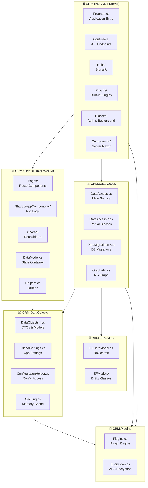

# Deep Dive: FreeCRM-main

> **Suite:** FreeCRM-main (Base Framework)  
> **Location:** `FreeCRM-main/`  
> **Status:** ✅ Active - Origin Framework  
> **Projects:** 6  
> **Last Updated:** 2025-01-XX

---

## Table of Contents

1. [Overview](#overview)
2. [Architecture Diagram](#architecture-diagram)
3. [Project Structure](#project-structure)
4. [Key Files Reference](#key-files-reference)
5. [Design Patterns](#design-patterns)
6. [Module System](#module-system)
7. [Plugin Architecture](#plugin-architecture)
8. [Authentication System](#authentication-system)
9. [Database Support](#database-support)
10. [Blazor Patterns](#blazor-patterns)
11. [API Endpoints](#api-endpoints)
12. [Configuration](#configuration)

---

## Overview

**FreeCRM-main** is the **origin framework** from which all other project suites are derived. It's a full-featured CRM (Customer Relationship Management) application built with:

- **ASP.NET Core 10** server with Blazor Server/WASM hybrid
- **Entity Framework Core** with multi-database support
- **Dynamic plugin system** using Roslyn compilation
- **Multi-tenant architecture** with tenant-specific settings
- **Modular feature system** with compile-time markers

### Key Characteristics

| Aspect | Implementation |
|--------|----------------|
| **Render Mode** | Blazor WebAssembly (Interactive) |
| **Authentication** | Multiple OAuth providers + Custom |
| **Database** | SQL Server, PostgreSQL, MySQL, SQLite, InMemory |
| **Real-time** | SignalR (local or Azure SignalR) |
| **Plugins** | Runtime C# compilation via Roslyn |
| **Multi-tenant** | URL-based tenant routing |

---

## Architecture Diagram



---

## Project Structure

### CRM (Server) - 6 Folders, ~30 Files

```
CRM/
├── appsettings.json              # Main configuration
├── appsettings.Development.json  # Dev overrides
├── Program.cs                    # Entry point + DI setup
├── Program.App.cs                # App-specific extensions
├── PluginsInterfaces.cs          # Plugin interface definitions
│
├── Classes/
│   ├── BackgroundProcessor.cs    # Hosted service for background tasks
│   ├── CustomAuthenticationHandler.cs
│   ├── CustomAuthIdentity.cs
│   └── RouteHelper.cs
│
├── Components/
│   ├── _Imports.razor
│   ├── App.razor                 # Root component
│   ├── Modules.App.razor         # Module definitions
│   └── Pages/
│       └── Error.razor
│
├── Controllers/
│   ├── AuthorizationController.cs
│   ├── DataController.cs         # Base controller
│   ├── DataController.Ajax.cs    # AJAX endpoints
│   ├── DataController.App.cs     # App-specific endpoints
│   ├── DataController.ApplicationSettings.cs
│   ├── DataController.Appointments.cs
│   ├── DataController.Authenticate.cs
│   ├── DataController.Departments.cs
│   ├── DataController.EmailTemplates.cs
│   ├── DataController.Encryption.cs
│   ├── DataController.FileStorage.cs
│   ├── DataController.Invoices.cs
│   ├── DataController.Language.cs
│   ├── DataController.Locations.cs
│   ├── DataController.Payments.cs
│   ├── DataController.Plugins.cs
│   ├── DataController.Services.cs
│   ├── DataController.Tags.cs
│   ├── DataController.Tenants.cs
│   ├── DataController.UDF.cs
│   ├── DataController.UserGroups.cs
│   ├── DataController.Users.cs
│   ├── DataController.Utilities.cs
│   └── SetupController.cs
│
├── Hubs/
│   └── signalrHub.cs             # SignalR hub
│
└── Plugins/                      # Built-in plugin examples
    ├── Example1.cs
    ├── Example2.cs
    ├── Example3.cs
    ├── ExampleBackgroundProcess.cs
    ├── LoginWithPrompts.cs
    └── UserUpdate.cs
```

### CRM.Client (Blazor WASM) - 5 Folders, ~90 Razor Files

```
CRM.Client/
├── _Imports.razor
├── DataModel.cs                  # Shared state container
├── DataModel.App.cs              # App-specific state
├── Helpers.cs                    # Utility functions
├── Helpers.App.cs                # App-specific helpers
├── Program.cs                    # WASM entry point
├── Routes.razor                  # Route definitions
│
├── Layout/
│   └── MainLayout.razor          # Main layout wrapper
│
├── Pages/
│   ├── About.razor
│   ├── ChangePassword.razor
│   ├── DatabaseOffline.razor
│   ├── Index.razor               # Home page
│   ├── NotFound.razor
│   ├── PasswordChanged.razor
│   ├── PluginTesting.razor
│   ├── Profile.razor
│   ├── ServerUpdated.razor
│   │
│   ├── Authorization/
│   │   ├── AccessDenied.razor
│   │   ├── InvalidUser.razor
│   │   ├── Login.razor
│   │   ├── Logout.razor
│   │   ├── NoLocalAccount.razor
│   │   └── ProcessLogin.razor
│   │
│   ├── Invoices/
│   │   ├── AppointmentInvoices.razor
│   │   ├── EditInvoice.razor
│   │   ├── Invoices.razor
│   │   └── ViewInvoice.razor
│   │
│   ├── Payments/
│   │   └── Payments.razor
│   │
│   ├── Scheduling/
│   │   ├── EditAppointment.razor
│   │   └── Schedule.razor
│   │
│   ├── Settings/
│   │   ├── Departments/
│   │   ├── Email/
│   │   ├── Files/
│   │   ├── Locations/
│   │   ├── Misc/
│   │   ├── Services/
│   │   ├── Tags/
│   │   ├── Tenants/
│   │   └── Users/
│   │
│   └── TestPages/
│       ├── DoubleClick.razor
│       ├── Monaco.razor
│       ├── Sort.razor
│       └── Test.razor
│
├── Shared/
│   ├── GeneratePasswordDialog.razor
│   ├── GetInputDialog.razor
│   ├── Highcharts.razor
│   ├── HtmlEditorDialog.razor
│   ├── Icon.razor
│   ├── Language.razor
│   ├── LastModifiedMessage.razor
│   ├── LoadingMessage.razor
│   ├── ModalMessage.razor
│   ├── MonacoEditor.razor
│   ├── NavigationMenu.razor
│   ├── OffcanvasPopoutMenu.razor
│   ├── PDF_Viewer.razor
│   ├── PluginPrompts.razor
│   ├── RenderFiles.razor
│   ├── RequiredIndicator.razor
│   ├── SelectFile.razor
│   ├── StickyMenuIcon.razor
│   ├── TagSelector.razor
│   ├── Tooltip.razor
│   ├── UndeleteMessage.razor
│   ├── UploadFile.razor
│   └── UserDefinedFields.razor
│
└── Shared/AppComponents/         # App-specific logic components
    ├── About.App.razor
    ├── AppSettings.App.razor
    ├── EditAppointment.App.razor
    ├── EditDepartment.App.razor
    ├── EditDepartmentGroup.App.razor
    ├── EditTag.App.razor
    ├── EditTenant.App.razor
    ├── EditUser.App.razor
    ├── Index.App.razor
    └── Settings.App.razor
```

### CRM.DataAccess - 25+ Partial Class Files

```
CRM.DataAccess/
├── GlobalUsings.cs
├── DataAccess.cs                 # Main class + constructor
├── DataAccess.Ajax.cs
├── DataAccess.App.cs
├── DataAccess.Appointments.cs
├── DataAccess.Authentication.cs
├── DataAccess.Departments.cs
├── DataAccess.EmailTemplates.cs
├── DataAccess.Encryption.cs
├── DataAccess.FileStorage.cs
├── DataAccess.Invoices.cs
├── DataAccess.Language.cs
├── DataAccess.Locations.cs
├── DataAccess.Payments.cs
├── DataAccess.Plugins.cs
├── DataAccess.Services.cs
├── DataAccess.Settings.cs
├── DataAccess.SignalR.cs
├── DataAccess.Tags.cs
├── DataAccess.Tenants.cs
├── DataAccess.UDFLabels.cs
├── DataAccess.UserGroups.cs
├── DataAccess.Users.cs
├── DataAccess.Utilities.cs
├── DataMigrations.MySQL.cs
├── DataMigrations.PostgreSQL.cs
├── DataMigrations.SQLite.cs
├── DataMigrations.SQLServer.cs
├── GraphAPI.cs
├── GraphAPI.App.cs
├── RandomPasswordGenerator.cs
├── RandomPasswordGenerator.App.cs
├── Utilities.cs
└── Utilities.App.cs
```

### CRM.DataObjects - DTOs & Shared Models

```
CRM.DataObjects/
├── Caching.cs
├── ConfigurationHelper.cs
├── ConfigurationHelper.App.cs
├── DataObjects.cs                # Core DTOs
├── DataObjects.ActiveDirectory.cs
├── DataObjects.Ajax.cs
├── DataObjects.App.cs
├── DataObjects.Appointments.cs
├── DataObjects.Departments.cs
├── DataObjects.EmailTemplates.cs
├── DataObjects.Invoices.cs
├── DataObjects.Locations.cs
├── DataObjects.Payments.cs
├── DataObjects.Services.cs
├── DataObjects.SignalR.cs
├── DataObjects.Tags.cs
├── DataObjects.UDFLabels.cs
├── DataObjects.UserGroups.cs
├── GlobalSettings.cs
└── GlobalSettings.App.cs
```

### CRM.EFModels - Entity Framework

```
CRM.EFModels/
├── EFModelOverrides.cs           # Partial class extensions
└── EFModels/
    ├── EFDataModel.cs            # DbContext
    ├── Appointment.cs
    ├── AppointmentNote.cs
    ├── AppointmentService.cs
    ├── AppointmentUser.cs
    ├── Department.cs
    ├── DepartmentGroup.cs
    ├── EmailTemplate.cs
    ├── FileStorage.cs
    ├── Invoice.cs
    ├── Location.cs
    ├── Payment.cs
    ├── PluginCache.cs
    ├── Service.cs
    ├── Setting.cs
    ├── Tag.cs
    ├── TagItem.cs
    ├── Tenant.cs
    ├── UDFLabel.cs
    ├── User.cs
    ├── UserGroup.cs
    └── UserInGroup.cs
```

### CRM.Plugins - Plugin Engine

```
CRM.Plugins/
├── Plugins.cs                    # Main plugin engine
└── Encryption.cs                 # AES encryption utilities
```

---

## Key Files Reference

### Entry Points

| File | Purpose | Key Responsibilities |
|------|---------|---------------------|
| `CRM/Program.cs` | Server entry | DI setup, authentication, SignalR, plugin loading |
| `CRM.Client/Program.cs` | WASM entry | WebAssembly host configuration |
| `CRM/Components/App.razor` | Root component | HTML head, routes, render mode |

### State Management

| File | Purpose | Pattern |
|------|---------|---------|
| `CRM.Client/DataModel.cs` | Global state container | Singleton service with `OnChange` event |
| `CRM.Client/DataModel.App.cs` | App-specific state | Partial class extension |
| `CRM.DataObjects/GlobalSettings.cs` | Server settings | Static class |

### Data Layer

| File | Purpose | Pattern |
|------|---------|---------|
| `CRM.DataAccess/DataAccess.cs` | Main service | Transient DI, partial classes |
| `CRM.EFModels/EFDataModel.cs` | DbContext | Multi-provider support |

---

## Design Patterns

### 1. Partial Class Organization

The codebase extensively uses **partial classes** to organize large files by domain:

```csharp
// DataAccess.cs - Base class with constructor
public partial class DataAccess : IDisposable, IDataAccess
{
    private string _connectionString;
    public DataAccess(string ConnectionString, ...) { }
}

// DataAccess.Users.cs - User-related methods
public partial class DataAccess
{
    public async Task<DataObjects.User> GetUser(Guid userId) { }
    public async Task<bool> SaveUser(DataObjects.User user) { }
}

// DataAccess.Appointments.cs - Appointment-related methods
public partial class DataAccess
{
    public async Task<List<DataObjects.Appointment>> GetAppointments() { }
}
```

### 2. Page + App Component Pattern

Each page follows a **two-file pattern**:

```
Pages/Index.razor           → Route definition, parameter handling, auth check
Shared/AppComponents/Index.App.razor → Actual UI and business logic
```

**Index.razor** (Route wrapper):
```razor
@page "/"
@page "/{TenantCode}"
@inject BlazorDataModel Model
@implements IDisposable

@if (Model.Loaded && Model.LoggedIn) {
    <Index_App />
}

@code {
    [Parameter] public string? TenantCode { get; set; }
    // Route handling, auth validation
}
```

**Index.App.razor** (App logic):
```razor
@inject BlazorDataModel Model

<h1>@Model.User.FirstName</h1>
<!-- Actual UI implementation -->

@code {
    public bool RequireLogin { get; set; } = false;
    // Business logic
}
```

### 3. Controller Partial Classes

API controllers use partial classes per domain:

```
DataController.cs              → Base controller, shared methods
DataController.Users.cs        → [HttpGet("api/Users")] endpoints
DataController.Appointments.cs → [HttpGet("api/Appointments")] endpoints
```

---

## Module System

FreeCRM uses **compile-time markers** to enable/disable features:

### Module Markers

```csharp
// In EFDataModel.cs
// {{ModuleItemStart:Appointments}}
public virtual DbSet<Appointment> Appointments { get; set; }
// {{ModuleItemEnd:Appointments}}

// {{ModuleItemStart:Invoices}}
public virtual DbSet<Invoice> Invoices { get; set; }
// {{ModuleItemEnd:Invoices}}
```

### Runtime Module Configuration

```json
// appsettings.json
{
  "GloballyDisabledModules": [
    "invoices",
    "scheduling"
  ],
  "GloballyEnabledModules": [
    "departments"
  ]
}
```

### Available Modules

| Module | Description | Entities |
|--------|-------------|----------|
| `appointments` | Scheduling system | Appointment, AppointmentNote, AppointmentService, AppointmentUser |
| `departments` | Organization structure | Department, DepartmentGroup |
| `emailtemplates` | Email templating | EmailTemplate |
| `files` | File storage | FileStorage |
| `invoices` | Billing | Invoice |
| `locations` | Physical locations | Location |
| `payments` | Payment processing | Payment |
| `services` | Service catalog | Service |
| `tags` | Tagging system | Tag, TagItem |
| `themes` | UI theming | (settings-based) |
| `udf` | User-defined fields | UDFLabel |
| `usergroups` | Permission groups | UserGroup, UserInGroup |

---

## Plugin Architecture

### Plugin Interface

```csharp
public interface IPlugins
{
    List<Plugin> AllPlugins { get; }
    List<Plugin> AllPluginsForCache { get; }
    
    T? ExecuteDynamicCSharpCode<T>(
        string code,
        IEnumerable<object>? objects,
        List<string>? additionalAssemblies,
        string Namespace,
        string Classname,
        string invokerFunction
    );
    
    List<Plugin> Load(string path);
    string PluginFolder { get; }
    List<string> ServerReferences { get; set; }
    List<string> UsingStatements { get; set; }
}
```

### Plugin Loading (Program.cs)

```csharp
// Load plugins from the Plugins folder
var plugins = new Plugins.Plugins();

// Setup server references for dynamic code execution
var serverReferences = new List<string>();
serverReferences.Add(typeof(DataAccess).Assembly.Location);
serverReferences.Add(typeof(DataObjects.BooleanResponse).Assembly.Location);
serverReferences.Add(typeof(EFModels.User).Assembly.Location);
// ... more assemblies

plugins.ServerReferences = serverReferences;

// Load using statements from config
var usingStatements = builder.Configuration
    .GetSection("PluginUsingStatements")
    .GetChildren()
    .Select(c => c.Value)
    .ToList();
plugins.UsingStatements = usingStatements;

// Load plugins
string pluginsPath = Path.Combine(AppDomain.CurrentDomain.BaseDirectory, "Plugins");
plugins.Load(pluginsPath);

// Register DI
builder.Services.AddTransient<Plugins.IPlugins>(x => plugins);
```

### Built-in Plugin Examples

| Plugin | Purpose | Hook Point |
|--------|---------|------------|
| `Example1.cs` | Demo plugin | General |
| `Example2.cs` | Demo plugin | General |
| `Example3.cs` | Demo plugin | General |
| `ExampleBackgroundProcess.cs` | Background task | BackgroundProcessor |
| `LoginWithPrompts.cs` | Login customization | Authentication |
| `UserUpdate.cs` | User save hook | User CRUD |

---

## Authentication System

### Supported Providers

```json
{
  "AuthenticationProviders": {
    "Apple": {
      "ClientId": "",
      "KeyId": "",
      "TeamId": ""
    },
    "Facebook": {
      "AppId": "",
      "AppSecret": ""
    },
    "Google": {
      "ClientId": "",
      "ClientSecret": ""
    },
    "MicrosoftAccount": {
      "ClientId": "",
      "ClientSecret": ""
    },
    "OpenId": {
      "ClientId": "",
      "ClientSecret": "",
      "Authority": "",
      "ButtonText": "Login with Our OpenId Provider",
      "ButtonClass": "btn btn-primary",
      "ButtonIcon": "fa-solid fa-right-to-bracket",
      "ForceHttps": true
    }
  }
}
```

### Authorization Policies

```csharp
var policies = new List<string> {
    "AppAdmin",
    "Admin",
    "CanBeScheduled",
    "ManageAppointments",
    "ManageFiles",
    "PreventPasswordChange",
};

builder.Services.AddAuthorization(options => {
    foreach (var p in policies) {
        options.AddPolicy(p, policy => 
            policy.RequireClaim(ClaimTypes.Role, p));
    }
});
```

---

## Database Support

### Multi-Provider Configuration

```csharp
switch (_databaseType.ToLower()) {
    case "inmemory":
        optionsBuilder.UseInMemoryDatabase("InMemory");
        break;
    case "mysql":
        optionsBuilder.UseMySQL(_connectionString, 
            options => options.EnableRetryOnFailure());
        break;
    case "postgresql":
        optionsBuilder.UseNpgsql(_connectionString, 
            options => options.EnableRetryOnFailure());
        break;
    case "sqlite":
        optionsBuilder.UseSqlite(_connectionString);
        break;
    case "sqlserver":
        optionsBuilder.UseSqlServer(_connectionString, 
            options => options.EnableRetryOnFailure());
        break;
}
```

### Connection String Examples

```json
{
  "ConnectionStrings": {
    // InMemory - no connection string needed
    "AppData": ""
    
    // MySQL
    "AppData": "Server=localhost;Database=CRM;User=sa;Password=saPassword"
    
    // PostgreSQL
    "AppData": "Host=localhost;Database=CRM;Username=postgres;Password=admin"
    
    // SQLite
    "AppData": "Data Source=C:\\Working\\CRM.db"
    
    // SQL Server
    "AppData": "Data Source=(local);Initial Catalog=CRM;Integrated Security=True;TrustServerCertificate=True"
  }
}
```

---

## Blazor Patterns

### State Container Pattern

```csharp
// DataModel.cs - Singleton state container
public partial class BlazorDataModel
{
    public event Action? OnChange;
    
    private bool _loaded = false;
    public bool Loaded {
        get => _loaded;
        set {
            _loaded = value;
            OnChange?.Invoke();
        }
    }
    
    public void NotifyStateChanged() => OnChange?.Invoke();
}
```

### Component Subscription Pattern

```razor
@implements IDisposable
@inject BlazorDataModel Model

@code {
    protected override void OnInitialized()
    {
        Model.OnChange += StateHasChanged;
    }

    public void Dispose()
    {
        Model.OnChange -= StateHasChanged;
    }
}
```

### Conditional Rendering Pattern

```razor
@if (Model.Loaded && Model.View == _pageName && Model.LoggedIn) {
    <ActualContent />
}
```

---

## API Endpoints

### Controller Base Pattern

```csharp
[ApiController]
[Route("api")]
public partial class DataController : ControllerBase
{
    private readonly IDataAccess _dataAccess;
    private readonly IHttpContextAccessor _httpContextAccessor;
    
    public DataController(IDataAccess dataAccess, 
        IHttpContextAccessor httpContextAccessor)
    {
        _dataAccess = dataAccess;
        _httpContextAccessor = httpContextAccessor;
    }
}
```

### Endpoint Categories

| Category | Route Prefix | Methods |
|----------|--------------|---------|
| Users | `/api/Users` | GetUsers, GetUser, SaveUser, DeleteUser |
| Appointments | `/api/Appointments` | GetAppointments, SaveAppointment |
| Settings | `/api/Settings` | GetSettings, SaveSettings |
| Files | `/api/File` | Upload, Download, View, Delete |
| Authentication | `/api/Auth` | Login, Logout, ValidateToken |

---

## Configuration

### Required Settings

| Setting | Type | Description |
|---------|------|-------------|
| `ConnectionStrings:AppData` | string | Database connection string |
| `DatabaseType` | string | `SQLServer`, `PostgreSQL`, `MySQL`, `SQLite`, `InMemory` |

### Optional Settings

| Setting | Type | Default | Description |
|---------|------|---------|-------------|
| `AzureSignalRurl` | string | empty | Azure SignalR connection (empty = local) |
| `BasePath` | string | empty | URL base path for reverse proxy |
| `AllowApplicationEmbedding` | bool | true | Allow iframe embedding |
| `LocalModeUrl` | string | empty | Local development URL |
| `AnalyticsCode` | string | empty | Google Analytics code |

### Background Service Settings

```json
{
  "BackgroundService": {
    "Enabled": true,
    "StartOnLoad": true,
    "ProcessingIntervalSeconds": 60,
    "LoadBalancingFilter": "",
    "LogFilePath": "C:\\Logs"
  }
}
```

---

## Summary

**FreeCRM-main** establishes the core patterns used across all derived suites:

| Pattern | Implementation |
|---------|----------------|
| **Project Structure** | 6-layer architecture (Server, Client, DataAccess, DataObjects, EFModels, Plugins) |
| **State Management** | Singleton `BlazorDataModel` with `OnChange` events |
| **Code Organization** | Partial classes grouped by domain |
| **Page Structure** | Route wrapper + App component separation |
| **API Design** | Partial controller classes per domain |
| **Database** | Multi-provider EF Core with runtime selection |
| **Extensibility** | Roslyn-based plugin system |
| **Modularity** | Compile-time markers + runtime configuration |

---

## 📬 About

**FreeCRM** is developed and maintained by **[Enrollment Information Technology (EIT)](https://em.wsu.edu/eit/meet-our-staff/)** at **Washington State University**.

📧 Questions or feedback? Visit our [team page](https://em.wsu.edu/eit/meet-our-staff/)
