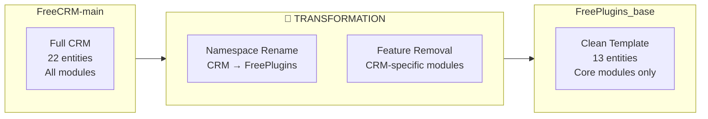
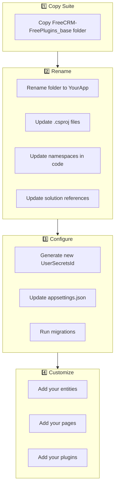

# Deep Dive: FreeCRM-FreePlugins_base

> **Suite:** FreeCRM-FreePlugins_base (Renamed Template)  
> **Location:** `FreeCRM-FreePlugins_base/`  
> **Status:** 📋 Template  
> **Projects:** 6  
> **Last Updated:** 2025-01-XX

---

## Table of Contents

1. [Overview](#overview)
2. [Relationship to FreeCRM](#relationship-to-freecrm)
3. [What Was Removed](#what-was-removed)
4. [What Was Renamed](#what-was-renamed)
5. [Project Structure](#project-structure)
6. [Plugin System](#plugin-system)
7. [Namespace Changes](#namespace-changes)
8. [Configuration Differences](#configuration-differences)
9. [Using as a Template](#using-as-a-template)

---

## Overview

**FreeCRM-FreePlugins_base** is a **namespace-renamed and feature-stripped template** derived from FreeCRM-main. It serves as the starting point for creating new applications based on the FreeCRM framework while removing CRM-specific features that may not be needed.

### Key Characteristics

| Aspect | FreeCRM-main | FreePlugins_base |
|--------|--------------|------------------|
| **Namespace** | `CRM` | `FreePlugins` |
| **Purpose** | Full CRM application | Clean template |
| **Modules** | All modules included | CRM modules removed |
| **Entity Count** | 22 entities | 13 entities |
| **Pages** | ~55 Razor pages | ~42 Razor pages |
| **Status** | Active development | Template/starting point |

---

## Relationship to FreeCRM



---

## What Was Removed

### Removed Modules

| Module | Entities Removed | Pages Removed | Controller Methods |
|--------|------------------|---------------|-------------------|
| **Appointments** | Appointment, AppointmentNote, AppointmentService, AppointmentUser | Schedule.razor, EditAppointment.razor | DataController.Appointments.cs |
| **Invoices** | Invoice | Invoices.razor, EditInvoice.razor, ViewInvoice.razor, AppointmentInvoices.razor | DataController.Invoices.cs |
| **Payments** | Payment | Payments.razor | DataController.Payments.cs |
| **Services** | Service | Services.razor, EditService.razor | DataController.Services.cs |
| **Locations** | Location | Locations.razor, EditLocation.razor | DataController.Locations.cs |
| **EmailTemplates** | EmailTemplate | EmailTemplates.razor, EditEmailTemplate.razor | DataController.EmailTemplates.cs |

### Entity Comparison

**FreeCRM-main (22 entities):**
```
Appointment, AppointmentNote, AppointmentService, AppointmentUser,
Department, DepartmentGroup, EmailTemplate, FileStorage, Invoice,
Location, Payment, PluginCache, Service, Setting, Tag, TagItem,
Tenant, UDFLabel, User, UserGroup, UserInGroup
```

**FreePlugins_base (13 entities):**
```
Department, DepartmentGroup, FileStorage, PluginCache, Setting,
Tag, TagItem, Tenant, UDFLabel, User, UserGroup, UserInGroup
```

### Page Count Comparison

| Category | FreeCRM-main | FreePlugins_base | Removed |
|----------|-------------|------------------|---------|
| Authorization | 6 | 6 | 0 |
| Settings | 25 | 19 | 6 |
| Scheduling | 2 | 0 | 2 |
| Invoices | 4 | 0 | 4 |
| Payments | 1 | 0 | 1 |
| Core | 17 | 17 | 0 |
| **Total** | **55** | **42** | **13** |

---

## What Was Renamed

### Namespace Transformations

| File Type | FreeCRM | FreePlugins_base |
|-----------|---------|------------------|
| Projects | `CRM.*` | `FreePlugins.*` |
| Namespace | `namespace CRM` | `namespace FreePlugins` |
| Using | `using CRM;` | `using FreePlugins;` |
| Interface refs | `CRM.DataAccess` | `FreePlugins.DataAccess` |
| EF namespace | `CRM.EFModels.EFModels` | `FreePlugins.EFModels.EFModels` |

### File-Level Changes

| Original (FreeCRM) | Renamed (FreePlugins_base) |
|--------------------|---------------------------|
| `CRM/CRM.csproj` | `FreePlugins/FreePlugins.csproj` |
| `CRM.Client/CRM.Client.csproj` | `FreePlugins.Client/FreePlugins.Client.csproj` |
| `CRM.DataAccess/CRM.DataAccess.csproj` | `FreePlugins.DataAccess/FreePlugins.DataAccess.csproj` |
| `CRM.DataObjects/CRM.DataObjects.csproj` | `FreePlugins.DataObjects/FreePlugins.DataObjects.csproj` |
| `CRM.EFModels/CRM.EFModels.csproj` | `FreePlugins.EFModels/FreePlugins.EFModels.csproj` |
| `CRM.Plugins/CRM.Plugins.csproj` | `FreePlugins.Plugins/FreePlugins.Plugins.csproj` |

### UserSecretsId Change

| Suite | UserSecretsId |
|-------|---------------|
| FreeCRM-main | `c3a4acfd-bf26-4267-98c7-6746a2b80f10` |
| FreePlugins_base | `e534f0ca-6a41-412e-bea9-d68886a17773` |

---

## Project Structure

### FreePlugins (Server) - Reduced Structure

```
FreePlugins/
├── appsettings.json
├── appsettings.Development.json
├── Program.cs
├── Program.App.cs
├── PluginsInterfaces.cs
│
├── Classes/
│   ├── BackgroundProcessor.cs
│   ├── CustomAuthenticationHandler.cs
│   ├── CustomAuthIdentity.cs
│   └── RouteHelper.cs
│
├── Components/
│   ├── _Imports.razor
│   ├── App.razor
│   ├── Modules.App.razor
│   └── Pages/Error.razor
│
├── Controllers/
│   ├── AuthorizationController.cs
│   ├── DataController.cs
│   ├── DataController.Ajax.cs
│   ├── DataController.App.cs
│   ├── DataController.ApplicationSettings.cs
│   ├── DataController.Authenticate.cs
│   ├── DataController.Departments.cs
│   ├── DataController.Encryption.cs
│   ├── DataController.FileStorage.cs
│   ├── DataController.Language.cs
│   ├── DataController.Plugins.cs
│   ├── DataController.Tags.cs
│   ├── DataController.Tenants.cs
│   ├── DataController.UDF.cs
│   ├── DataController.UserGroups.cs
│   ├── DataController.Users.cs
│   ├── DataController.Utilities.cs
│   └── SetupController.cs
│
├── Hubs/
│   └── signalrHub.cs
│
└── Plugins/
    ├── Example1.cs
    ├── Example2.cs
    ├── Example3.cs
    ├── ExampleBackgroundProcess.cs
    ├── HelloWorld.assemblies
    ├── HelloWorld.plugin
    ├── LoginWithPrompts.cs
    ├── Plugins.md
    └── UserUpdate.cs
```

### FreePlugins.Client - Reduced Pages

```
FreePlugins.Client/
├── Pages/
│   ├── About.razor
│   ├── Authorization/ (6 pages - unchanged)
│   ├── ChangePassword.razor
│   ├── DatabaseOffline.razor
│   ├── Index.razor
│   ├── NotFound.razor
│   ├── PasswordChanged.razor
│   ├── PluginTesting.razor
│   ├── Profile.razor
│   ├── ServerUpdated.razor
│   │
│   ├── Settings/
│   │   ├── Departments/ (4 pages)
│   │   ├── Files/ (2 pages)
│   │   ├── Misc/ (7 pages)
│   │   ├── Tags/ (2 pages)
│   │   ├── Tenants/ (2 pages)
│   │   └── Users/ (4 pages)
│   │   │
│   │   │ ❌ REMOVED:
│   │   │ ├── Email/ (2 pages)
│   │   │ ├── Locations/ (2 pages)
│   │   │ └── Services/ (2 pages)
│   │
│   └── TestPages/ (4 pages - unchanged)
│
│ ❌ REMOVED:
│ ├── Invoices/ (4 pages)
│ ├── Payments/ (1 page)
│ └── Scheduling/ (2 pages)
```

### FreePlugins.EFModels - Reduced Entities

```
FreePlugins.EFModels/
└── EFModels/
    ├── EFDataModel.cs          # DbContext (reduced)
    ├── Department.cs
    ├── DepartmentGroup.cs
    ├── FileStorage.cs
    ├── PluginCache.cs
    ├── Setting.cs
    ├── Tag.cs
    ├── TagItem.cs
    ├── Tenant.cs
    ├── UDFLabel.cs
    ├── User.cs
    ├── UserGroup.cs
    └── UserInGroup.cs
    │
    │ ❌ REMOVED:
    │ ├── Appointment.cs
    │ ├── AppointmentNote.cs
    │ ├── AppointmentService.cs
    │ ├── AppointmentUser.cs
    │ ├── EmailTemplate.cs
    │ ├── Invoice.cs
    │ ├── Location.cs
    │ ├── Payment.cs
    │ └── Service.cs
```

---

## Plugin System

### Plugin Interface (Namespace Changed)

The plugin interfaces are identical to FreeCRM but use the `FreePlugins` namespace:

```csharp
// FreePlugins/PluginsInterfaces.cs
using FreePlugins;  // Changed from 'using CRM;'

public interface IPlugin : IPluginBase
{
    Task<(bool Result, List<string>? Messages, IEnumerable<object>? Objects)> Execute(
        FreePlugins.DataAccess da,      // Changed namespace
        Plugins.Plugin plugin,
        FreePlugins.DataObjects.User? currentUser  // Changed namespace
    );
}

public interface IPluginAuth : IPluginBase
{
    Task<(bool Result, List<string>? Messages, IEnumerable<object>? Objects)> Login(
        DataAccess da,  // Now resolves to FreePlugins.DataAccess
        Plugins.Plugin plugin,
        string url,
        Guid tenantId,
        Microsoft.AspNetCore.Http.HttpContext httpContext
    );
    // ... Logout method
}

public interface IPluginBackgroundProcess : IPluginBase
{
    Task<(bool Result, List<string>? Messages, IEnumerable<object>? Objects)> Execute(
        DataAccess da,  // Now resolves to FreePlugins.DataAccess
        Plugins.Plugin plugin,
        long iteration
    );
}

public interface IPluginUserUpdate : IPluginBase
{
    Task<(bool Result, List<string>? Messages, IEnumerable<object>? Objects)> UpdateUser(
        DataAccess da,
        Plugins.Plugin plugin,
        FreePlugins.DataObjects.User? updateUser  // Changed namespace
    );
}
```

### Built-in Plugins (Unchanged Structure)

| Plugin File | Type | Status |
|-------------|------|--------|
| `Example1.cs` | IPlugin | Demo - All prompt types |
| `Example2.cs` | IPlugin | Demo |
| `Example3.cs` | IPlugin | Demo |
| `ExampleBackgroundProcess.cs` | IPluginBackgroundProcess | Demo - Scheduled tasks |
| `LoginWithPrompts.cs` | IPluginAuth | Demo - Custom login |
| `UserUpdate.cs` | IPluginUserUpdate | Demo - User save hook |
| `HelloWorld.plugin` | External | Demo - External DLL |

### Plugin Namespace in Code

Plugins need to reference the correct namespace when accessing DataAccess:

```csharp
// FreeCRM plugin
using CRM;
public class MyPlugin : IPlugin
{
    public async Task<...> Execute(CRM.DataAccess da, ...) { }
}

// FreePlugins_base plugin (must change using)
using FreePlugins;
public class MyPlugin : IPlugin
{
    public async Task<...> Execute(FreePlugins.DataAccess da, ...) { }
}
```

### Plugin Portability

> ⚠️ **Important:** Plugins from FreeCRM-main are **NOT directly portable** to FreePlugins_base due to namespace differences. They require updating `using` statements and type references.

---

## Namespace Changes

### Complete Namespace Map

| Layer | FreeCRM-main | FreePlugins_base |
|-------|--------------|------------------|
| Server | `CRM` | `FreePlugins` |
| Client | `CRM.Client` | `FreePlugins.Client` |
| DataAccess | `CRM` (partial) | `FreePlugins` (partial) |
| DataObjects | `CRM.DataObjects` | `FreePlugins.DataObjects` |
| EFModels | `CRM.EFModels.EFModels` | `FreePlugins.EFModels.EFModels` |
| Plugins | `Plugins` | `Plugins` (unchanged) |
| Hubs | `CRM.Server.Hubs` | `FreePlugins.Server.Hubs` |

### Key Using Statement Changes

```csharp
// FreeCRM-main
using CRM;
using CRM.Client;
using CRM.Client.Pages;
using CRM.Components;
using CRM.Server.Hubs;
using CRM.EFModels.EFModels;

// FreePlugins_base
using FreePlugins;
using FreePlugins.Client;
using FreePlugins.Client.Pages;
using FreePlugins.Components;
using FreePlugins.Server.Hubs;
using FreePlugins.EFModels.EFModels;
```

---

## Configuration Differences

### appsettings.json Comparison

The configuration structure is identical, but some module-related settings may be irrelevant:

```json
{
  "GloballyDisabledModules": [
    // These don't exist in FreePlugins_base:
    // "invoices",      ❌ Removed
    // "scheduling",    ❌ Removed
    // "services",      ❌ Removed
    // "location",      ❌ Removed
    // "emailtemplates" ❌ Removed
    
    // These still work:
    "departments",
    "files",
    "tags",
    "themes",
    "udf",
    "usergroups"
  ]
}
```

### Database Connection

Same configuration, but migrations will create fewer tables:

| Suite | Tables Created |
|-------|---------------|
| FreeCRM-main | 21 tables |
| FreePlugins_base | 13 tables |

---

## Using as a Template

### When to Use FreePlugins_base

✅ **Use this template when:**
- Building a non-CRM application
- Don't need scheduling/appointments
- Don't need invoicing/payments
- Want a cleaner starting point
- Building a plugin showcase (like FreePluginsV1)

❌ **Don't use when:**
- Need full CRM functionality
- Need appointments/scheduling
- Need invoicing/payments
- Want all features available

### Fork Process



### Quick Start Commands

```powershell
# 1. Copy the template
Copy-Item -Recurse "FreeCRM-FreePlugins_base" "MyNewApp"

# 2. Rename files (manual or use FreeTools.ForkCRM)
# FreeTools.ForkCRM automates this process

# 3. Generate new UserSecretsId
dotnet user-secrets init --project MyNewApp/MyNewApp/MyNewApp.csproj

# 4. Run the app
dotnet run --project MyNewApp/MyNewApp/MyNewApp.csproj
```

---

## Summary

**FreePlugins_base** is the **recommended starting point** for new applications that:

1. Need the FreeCRM framework architecture
2. Don't need CRM-specific features
3. Want a cleaner, smaller codebase

### Comparison Table

| Metric | FreeCRM-main | FreePlugins_base | Reduction |
|--------|-------------|------------------|-----------|
| Entities | 22 | 13 | -41% |
| Pages | 55 | 42 | -24% |
| Controller Files | 25 | 18 | -28% |
| DataAccess Files | 28 | 21 | -25% |

### Plugin Compatibility Note

When creating plugins for FreePlugins_base (or any derived project):

1. Use `FreePlugins` namespace instead of `CRM`
2. Reference `FreePlugins.DataObjects.User` instead of `CRM.DataObjects.User`
3. The `Plugins` namespace for `Plugin`, `PluginPrompt`, etc. remains unchanged

---

## 📬 About

**FreePlugins** is developed and maintained by **[Enrollment Information Technology (EIT)](https://em.wsu.edu/eit/meet-our-staff/)** at **Washington State University**.

📧 Questions or feedback? Visit our [team page](https://em.wsu.edu/eit/meet-our-staff/)
