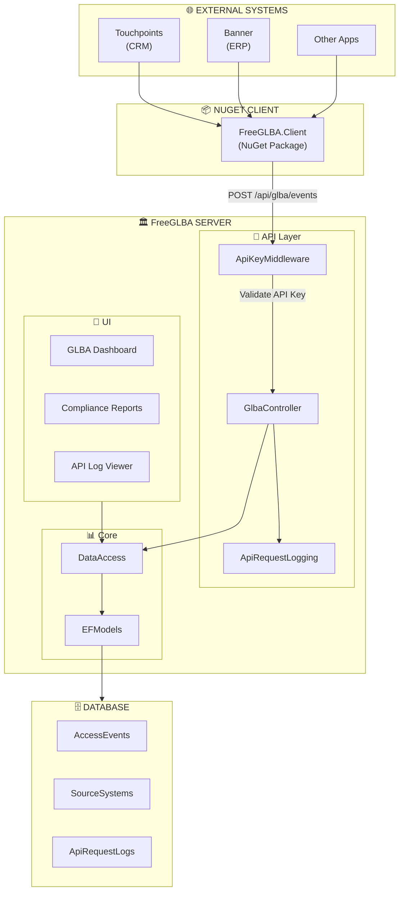
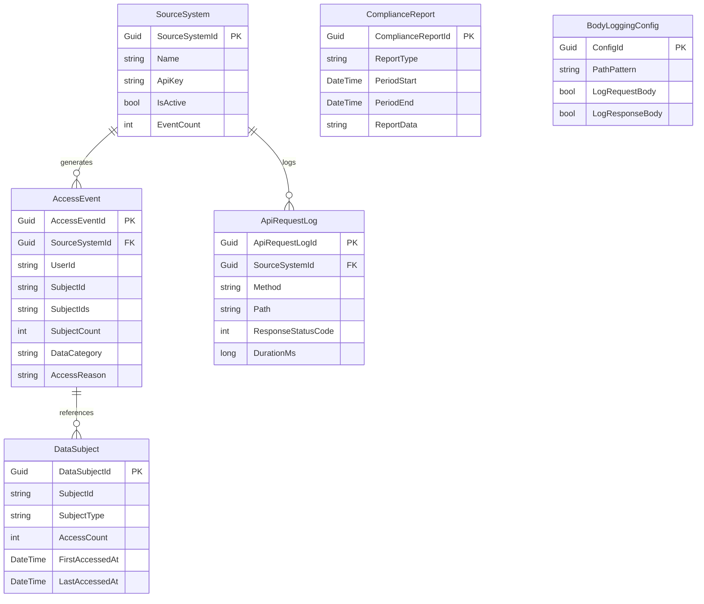

# Deep Dive: FreeGLBA-main

> **Suite:** FreeGLBA-main (GLBA Compliance - Newest Implementation)  
> **Location:** `FreeGLBA-main/`  
> **Status:** ✅ Active - Production  
> **Projects:** 10  
> **Last Updated:** 2025-01-XX

---

## Table of Contents

1. [Overview](#overview)
2. [Architecture Diagram](#architecture-diagram)
3. [What Makes FreeGLBA Unique](#what-makes-freeglba-unique)
4. [Project Structure](#project-structure)
5. [GLBA-Specific Features](#glba-specific-features)
6. [NuGet Client Library](#nuget-client-library)
7. [API Design](#api-design)
8. [Entity Model](#entity-model)
9. [Plugin System](#plugin-system)
10. [Best Practices from This Suite](#best-practices-from-this-suite)

---

## Overview

**FreeGLBA** is a **GLBA (Gramm-Leach-Bliley Act) compliance tracking system** built on the FreeCRM framework. It's the **newest and most polished** implementation, featuring:

- **External API with key authentication** for receiving events from source systems
- **NuGet client library** for easy integration with other .NET applications
- **Comprehensive audit logging** of API requests
- **Dashboard and reporting** for compliance officers
- **Bulk event processing** for high-volume exports

### Key Characteristics

| Aspect | Implementation |
|--------|----------------|
| **Purpose** | Track who accessed protected financial information |
| **Namespace** | `FreeGLBA` |
| **Extra Projects** | NugetClient, NugetClientPublisher, TestClient, TestClientWithNugetPackage |
| **API Auth** | API Key via middleware |
| **Entity Count** | 19 (base 13 + 6 GLBA-specific) |
| **NuGet Package** | `FreeGLBA.Client` on nuget.org |

---

## Architecture Diagram



---

## What Makes FreeGLBA Unique

### Compared to Base Framework

| Feature | FreePlugins_base | FreeGLBA |
|---------|------------------|----------|
| **Projects** | 6 | 10 (+4 for NuGet) |
| **Entities** | 13 | 19 (+6 GLBA) |
| **External API** | ❌ | ✅ API Key auth |
| **NuGet Package** | ❌ | ✅ Published |
| **API Logging** | ❌ | ✅ Full audit |
| **Dashboard** | Basic | GLBA-specific |
| **Middleware** | None | ApiKeyMiddleware |

### Additional Projects

| Project | Purpose | Type |
|---------|---------|------|
| `FreeGLBA.NugetClient` | Client library for external apps | Library (NuGet) |
| `FreeGLBA.NugetClientPublisher` | Publishes to nuget.org | Console |
| `FreeGLBA.TestClient` | Tests client via project ref | Console |
| `FreeGLBA.TestClientWithNugetPackage` | Tests published NuGet | Console |

---

## Project Structure

### New/Modified Files (GLBA-Specific)

```
FreeGLBA-main/
├── FreeGLBA/
│   └── Controllers/
│       ├── FreeGLBA.App.ApiKeyMiddleware.cs      # API key validation
│       ├── FreeGLBA.App.ApiRequestLoggingAttribute.cs
│       ├── FreeGLBA.App.DataController.cs        # App-specific endpoints
│       ├── FreeGLBA.App.GlbaController.cs        # External API
│       └── FreeGLBA.App.SkipApiLoggingAttribute.cs
│
├── FreeGLBA.Client/
│   └── Pages/
│       ├── FreeGLBA.App.AccessEventsPage.razor   # View access events
│       ├── FreeGLBA.App.AccessorsPage.razor      # Who accessed data
│       ├── FreeGLBA.App.ApiLogDashboard.razor    # API health
│       ├── FreeGLBA.App.ApiRequestLogs.razor     # Request history
│       ├── FreeGLBA.App.BodyLoggingSettings.razor
│       ├── FreeGLBA.App.ComplianceReportsPage.razor
│       ├── FreeGLBA.App.DataSubjectsPage.razor   # Whose data was accessed
│       ├── FreeGLBA.App.GlbaDashboard.razor      # Main dashboard
│       ├── FreeGLBA.App.SourceSystemsPage.razor  # Manage API keys
│       └── FreeGLBA.App.ViewApiRequestLog.razor
│
├── FreeGLBA.DataAccess/
│   ├── FreeGLBA.App.DataAccess.AccessEvents.cs
│   ├── FreeGLBA.App.DataAccess.ApiLogging.cs
│   ├── FreeGLBA.App.DataAccess.ComplianceReports.cs
│   ├── FreeGLBA.App.DataAccess.cs
│   ├── FreeGLBA.App.DataAccess.DataSubjects.cs
│   └── FreeGLBA.App.DataAccess.SourceSystems.cs
│
├── FreeGLBA.DataObjects/
│   ├── FreeGLBA.App.DataObjects.ApiLogging.cs
│   ├── FreeGLBA.App.DataObjects.cs
│   ├── FreeGLBA.App.DataObjects.ExternalApi.cs
│   └── FreeGLBA.App.Endpoints.cs
│
├── FreeGLBA.EFModels/
│   └── EFModels/
│       ├── FreeGLBA.App.AccessEvent.cs
│       ├── FreeGLBA.App.ApiRequestLog.cs
│       ├── FreeGLBA.App.BodyLoggingConfig.cs
│       ├── FreeGLBA.App.ComplianceReport.cs
│       ├── FreeGLBA.App.DataSubject.cs
│       ├── FreeGLBA.App.EFDataModel.cs           # Extended DbContext
│       └── FreeGLBA.App.SourceSystem.cs
│
├── FreeGLBA.NugetClient/                         # 📦 NEW PROJECT
│   ├── Extensions/ServiceCollectionExtensions.cs
│   ├── GlbaClient.cs
│   ├── GlbaClientOptions.cs
│   ├── IGlbaClient.cs
│   ├── Models/
│   │   ├── GlbaEventRequest.cs
│   │   ├── GlbaEventResponse.cs
│   │   └── GlbaException.cs
│   └── README.md
│
├── FreeGLBA.NugetClientPublisher/                # 📦 NEW PROJECT
│   ├── Program.cs
│   └── appsettings.json
│
├── FreeGLBA.TestClient/                          # 📦 NEW PROJECT
│   ├── Program.cs
│   └── appsettings.json
│
└── FreeGLBA.TestClientWithNugetPackage/          # 📦 NEW PROJECT
    ├── Program.cs
    └── appsettings.json
```

### File Naming Convention

FreeGLBA uses a **naming convention** for app-specific files:

```
FreeGLBA.App.{Feature}.cs
```

This makes it easy to identify which files are:
- **Framework files** (inherited from FreePlugins_base)
- **Application-specific files** (prefixed with `FreeGLBA.App.`)

---

## GLBA-Specific Features

### 1. Access Event Tracking

Records every access to protected financial information:

```csharp
public partial class AccessEventItem
{
    public Guid AccessEventId { get; set; }
    public Guid SourceSystemId { get; set; }
    public string SourceEventId { get; set; }      // Deduplication
    public DateTime AccessedAt { get; set; }
    public DateTime ReceivedAt { get; set; }
    
    // Who accessed
    public string UserId { get; set; }
    public string UserName { get; set; }
    public string UserEmail { get; set; }
    public string UserDepartment { get; set; }
    
    // What was accessed
    public string SubjectId { get; set; }          // Single subject
    public string SubjectIds { get; set; }         // Bulk (JSON array)
    public int SubjectCount { get; set; }          // Quick count
    public string SubjectType { get; set; }
    public string DataCategory { get; set; }
    
    // Why
    public string AccessReason { get; set; }
    public string BusinessPurpose { get; set; }
}
```

### 2. Source System Management

API keys for external systems:

```csharp
public partial class SourceSystemItem
{
    public Guid SourceSystemId { get; set; }
    public string Name { get; set; }
    public string Description { get; set; }
    public string ApiKey { get; set; }            // Hashed
    public bool IsActive { get; set; }
    public DateTime? LastEventAt { get; set; }
    public int EventCount { get; set; }
}
```

### 3. API Request Logging

Full audit trail of all API calls:

```csharp
public partial class ApiRequestLogItem
{
    public Guid ApiRequestLogId { get; set; }
    public DateTime Timestamp { get; set; }
    public string Method { get; set; }
    public string Path { get; set; }
    public string QueryString { get; set; }
    public string RequestBody { get; set; }       // Configurable
    public int ResponseStatusCode { get; set; }
    public string ResponseBody { get; set; }      // Configurable
    public long DurationMs { get; set; }
    public Guid? SourceSystemId { get; set; }
    public string ClientIp { get; set; }
}
```

### 4. Compliance Reports

Pre-built reports for auditors:

```csharp
public partial class ComplianceReportItem
{
    public Guid ComplianceReportId { get; set; }
    public string ReportType { get; set; }
    public DateTime GeneratedAt { get; set; }
    public DateTime PeriodStart { get; set; }
    public DateTime PeriodEnd { get; set; }
    public string GeneratedBy { get; set; }
    public string ReportData { get; set; }        // JSON
    public string Status { get; set; }
}
```

---

## NuGet Client Library

### Package: `FreeGLBA.Client`

Published to nuget.org for external .NET applications to integrate with FreeGLBA.

#### Installation

```bash
dotnet add package FreeGLBA.Client
```

#### Usage

```csharp
// Direct instantiation
var client = new GlbaClient("https://glba.example.com", "your-api-key");

// Log single event
var response = await client.LogAccessAsync(new GlbaEventRequest
{
    UserId = "jsmith",
    UserName = "John Smith",
    SubjectId = "STU123456",
    SubjectType = "Student",
    DataCategory = "Financial Aid",
    AccessReason = "Reviewed financial aid package",
    AccessedAt = DateTime.UtcNow
});

// Log batch (up to 1000)
var events = GetExportedRecords().Select(r => new GlbaEventRequest { ... });
var batchResponse = await client.LogAccessBatchAsync(events);
```

#### Dependency Injection

```csharp
// In Program.cs
builder.Services.AddGlbaClient(options =>
{
    options.Endpoint = "https://glba.example.com";
    options.ApiKey = builder.Configuration["GlbaApiKey"];
});

// In your service
public class MyService
{
    private readonly IGlbaClient _glbaClient;
    
    public MyService(IGlbaClient glbaClient)
    {
        _glbaClient = glbaClient;
    }
}
```

### Client Features

| Feature | Description |
|---------|-------------|
| **Single Event** | `LogAccessAsync()` |
| **Batch Events** | `LogAccessBatchAsync()` (max 1000) |
| **Fire-and-Forget** | `TryLogAccessAsync()` (swallows errors) |
| **Retry Logic** | Exponential backoff |
| **DI Support** | `AddGlbaClient()` extension |

---

## API Design

### External API (API Key Auth)

```
POST /api/glba/events              # Single event
POST /api/glba/events/batch        # Batch (max 1000)
GET  /api/glba/events/{id}         # Get event details
```

### Internal API (User Auth)

```
GET  /api/glba/stats/summary       # Dashboard stats
GET  /api/glba/events/recent       # Recent events
GET  /api/glba/subjects            # Data subjects list
GET  /api/glba/accessors           # Who accessed data
GET  /api/glba/reports             # Compliance reports
```

### API Key Middleware

```csharp
// FreeGLBA.App.ApiKeyMiddleware.cs
public class ApiKeyMiddleware
{
    public async Task InvokeAsync(HttpContext context)
    {
        if (context.Request.Path.StartsWithSegments("/api/glba"))
        {
            var apiKey = context.Request.Headers["Authorization"]
                .FirstOrDefault()?.Replace("Bearer ", "");
            
            if (!string.IsNullOrEmpty(apiKey))
            {
                var source = await _da.ValidateApiKeyAsync(apiKey);
                if (source != null)
                {
                    context.Items["SourceSystem"] = source;
                }
            }
        }
        
        await _next(context);
    }
}
```

---

## Entity Model

### GLBA-Specific Entities



### Extended DbContext

```csharp
// FreeGLBA.App.EFDataModel.cs
public partial class EFDataModel
{
    // GLBA-specific entities
    public virtual DbSet<AccessEventItem> AccessEvents { get; set; }
    public virtual DbSet<ApiRequestLogItem> ApiRequestLogs { get; set; }
    public virtual DbSet<BodyLoggingConfigItem> BodyLoggingConfigs { get; set; }
    public virtual DbSet<ComplianceReportItem> ComplianceReports { get; set; }
    public virtual DbSet<DataSubjectItem> DataSubjects { get; set; }
    public virtual DbSet<SourceSystemItem> SourceSystems { get; set; }
}
```

---

## Plugin System

### Plugin Status

FreeGLBA includes **all standard plugins** from the base framework:

| Plugin | File | Status |
|--------|------|--------|
| Example1 | `Example1.cs` | ✅ Demo |
| Example2 | `Example2.cs` | ✅ Demo |
| Example3 | `Example3.cs` | ✅ Demo |
| ExampleBackgroundProcess | `ExampleBackgroundProcess.cs` | ✅ Demo |
| LoginWithPrompts | `LoginWithPrompts.cs` | ✅ Demo |
| UserUpdate | `UserUpdate.cs` | ✅ Demo |

### Namespace for Plugins

```csharp
// FreeGLBA plugins use the FreeGLBA namespace
using FreeGLBA;

public class MyGlbaPlugin : IPlugin
{
    public async Task<...> Execute(
        FreeGLBA.DataAccess da,
        Plugins.Plugin plugin,
        FreeGLBA.DataObjects.User? currentUser)
    { }
}
```

### Potential GLBA-Specific Plugins

The plugin system could be extended for GLBA-specific functionality:

| Plugin Type | Use Case |
|-------------|----------|
| `IPluginAccessEvent` | Hook into access event processing |
| `IPluginComplianceReport` | Custom report generation |
| `IPluginAlertTrigger` | Alert on suspicious access patterns |

---

## Best Practices from This Suite

### 1. File Naming Convention

Use `{AppName}.App.{Feature}.cs` for app-specific files:

```
✅ FreeGLBA.App.DataAccess.AccessEvents.cs
✅ FreeGLBA.App.GlbaController.cs
❌ AccessEventsDataAccess.cs
❌ GlbaController.cs
```

### 2. NuGet Client Pattern

If your app needs an external client library:

```
MyApp.NugetClient/
├── Extensions/ServiceCollectionExtensions.cs    # AddMyAppClient()
├── MyAppClient.cs                               # Main client
├── MyAppClientOptions.cs                        # Configuration
├── IMyAppClient.cs                              # Interface
├── Models/
│   ├── Request.cs
│   ├── Response.cs
│   └── Exception.cs
└── README.md                                    # Package docs
```

### 3. API Key Authentication

For external APIs that need non-user authentication:

```csharp
// 1. Create middleware
public class ApiKeyMiddleware { }

// 2. Store keys in SourceSystems table (hashed)

// 3. Attach source to HttpContext.Items

// 4. Use in controller
var source = HttpContext.Items["SourceSystem"] as SourceSystem;
```

### 4. API Request Logging

For compliance requirements:

```csharp
// 1. Create attribute
[ApiRequestLogging]
public class GlbaController { }

// 2. Optionally skip specific endpoints
[SkipApiLogging]
public async Task<IActionResult> HealthCheck() { }

// 3. Configure body logging per path
// (store in BodyLoggingConfig table)
```

### 5. Test Projects

Include test projects that validate your client library:

```
MyApp.TestClient/              # Uses project reference
MyApp.TestClientWithNugetPackage/   # Uses published NuGet
```

---

## Summary

**FreeGLBA** demonstrates how to extend the FreeCRM framework for a specific compliance domain:

| Pattern | Implementation |
|---------|----------------|
| **Domain Extension** | 6 new entities for GLBA compliance |
| **External API** | API key auth via middleware |
| **NuGet Distribution** | Client library on nuget.org |
| **File Organization** | `{AppName}.App.{Feature}.cs` convention |
| **API Logging** | Full audit trail with configurable body capture |
| **Testing** | Separate projects for project ref vs NuGet testing |

### Key Takeaways for FreePluginsV1

1. **File naming convention** makes app-specific code easy to identify
2. **NuGet client pattern** is reusable for any integration
3. **API middleware** pattern for non-user authentication
4. **Partial DbContext** extension keeps entity changes isolated

---

## 📬 About

**FreeGLBA** is developed and maintained by **[Enrollment Information Technology (EIT)](https://em.wsu.edu/eit/meet-our-staff/)** at **Washington State University**.

📧 Questions or feedback? Visit our [team page](https://em.wsu.edu/eit/meet-our-staff/)
