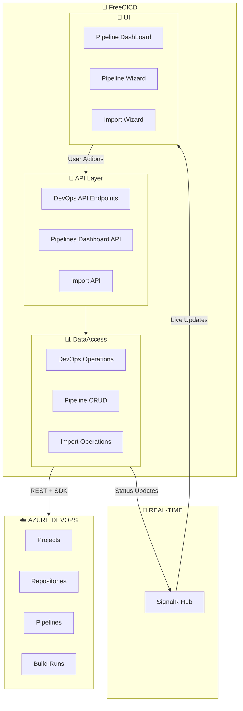
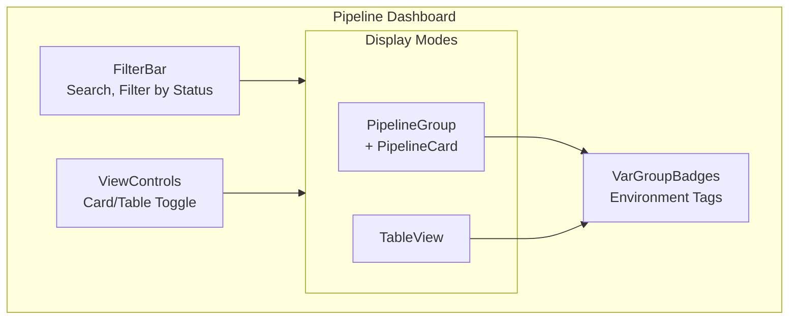
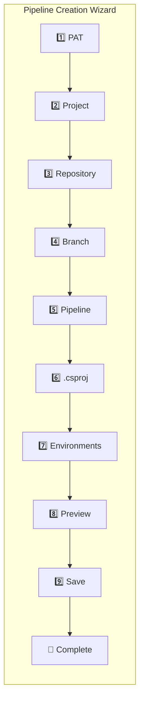

# Deep Dive: FreeCICD-main

> **Suite:** FreeCICD-main (CI/CD Implementation)  
> **Location:** `FreeCICD-main/`  
> **Status:** ✅ Active  
> **Projects:** 6  
> **Last Updated:** 2025-01-XX

---

## Table of Contents

1. [Overview](#overview)
2. [Architecture Diagram](#architecture-diagram)
3. [What Makes FreeCICD Unique](#what-makes-freecicd-unique)
4. [Project Structure](#project-structure)
5. [Azure DevOps Integration](#azure-devops-integration)
6. [Pipeline Dashboard](#pipeline-dashboard)
7. [Wizard System](#wizard-system)
8. [Plugin System](#plugin-system)
9. [Version Drift Warning](#version-drift-warning)
10. [Best Practices from This Suite](#best-practices-from-this-suite)

---

## Overview

**FreeCICD** is an **Azure DevOps pipeline management tool** built on the FreeCRM framework. It provides:

- **Pipeline Dashboard** for monitoring CI/CD pipelines across projects
- **Pipeline Wizard** for creating/updating YAML pipelines
- **Azure DevOps API Integration** for real-time status
- **Multi-step Import** for public repository onboarding

### Key Characteristics

| Aspect | Implementation |
|--------|----------------|
| **Purpose** | Manage Azure DevOps pipelines |
| **Namespace** | `FreeCICD` |
| **External APIs** | Azure DevOps REST API |
| **Key Packages** | `Microsoft.TeamFoundationServer.Client`, `YamlDotNet` |
| **UI Feature** | Multi-step wizard with SignalR updates |

---

## Architecture Diagram



---

## What Makes FreeCICD Unique

### Compared to Base Framework

| Feature | FreePlugins_base | FreeCICD |
|---------|------------------|----------|
| **External API** | None | Azure DevOps SDK |
| **Key Packages** | Standard | TFS Client, YamlDotNet, NuGet.Protocol |
| **UI Patterns** | Basic pages | Multi-step wizard |
| **Real-time** | Basic SignalR | Wizard progress updates |
| **File Types** | Standard | YAML generation |

### Unique NuGet Packages

```xml
<!-- FreeCICD.DataAccess.csproj -->
<PackageReference Include="Microsoft.TeamFoundation.DistributedTask.WebApi" Version="19.225.1" />
<PackageReference Include="Microsoft.TeamFoundationServer.Client" Version="19.225.1" />
<PackageReference Include="Microsoft.VisualStudio.Services.Client" Version="19.225.1" />
<PackageReference Include="NuGet.Protocol" Version="7.0.1" />
<PackageReference Include="YamlDotNet" Version="16.3.0" />
```

---

## Project Structure

### FreeCICD-Specific Files

```
FreeCICD-main/
├── FreeCICD/
│   ├── Classes/
│   │   └── FreeCICD.App.Config.cs              # App configuration
│   ├── Controllers/
│   │   └── FreeCICD.App.API.cs                 # DevOps endpoints
│   └── FreeCICD.App.Program.cs                 # App startup
│
├── FreeCICD.Client/
│   ├── Pages/
│   │   └── App/
│   │       └── FreeCICD.App.Pages.Pipelines.razor
│   └── Shared/
│       └── AppComponents/
│           ├── FreeCICD.App.UI.Dashboard.FilterBar.razor
│           ├── FreeCICD.App.UI.Dashboard.PipelineCard.razor
│           ├── FreeCICD.App.UI.Dashboard.PipelineGroup.razor
│           ├── FreeCICD.App.UI.Dashboard.Pipelines.razor
│           ├── FreeCICD.App.UI.Dashboard.TableView.razor
│           ├── FreeCICD.App.UI.Dashboard.VarGroupBadges.razor
│           ├── FreeCICD.App.UI.Dashboard.ViewControls.razor
│           ├── FreeCICD.App.UI.Import.razor
│           ├── FreeCICD.App.UI.Wizard.razor
│           └── Pipelines.App.razor
│       └── Wizard/                              # 📌 Wizard components
│           ├── FreeCICD.App.UI.Wizard.LoadingIndicator.razor
│           ├── FreeCICD.App.UI.Wizard.StepBranch.razor
│           ├── FreeCICD.App.UI.Wizard.StepCompleted.razor
│           ├── FreeCICD.App.UI.Wizard.StepCsproj.razor
│           ├── FreeCICD.App.UI.Wizard.StepEnvironments.razor
│           ├── FreeCICD.App.UI.Wizard.StepHeader.razor
│           ├── FreeCICD.App.UI.Wizard.StepPAT.razor
│           ├── FreeCICD.App.UI.Wizard.Stepper.razor
│           ├── FreeCICD.App.UI.Wizard.StepPipeline.razor
│           ├── FreeCICD.App.UI.Wizard.StepPreview.razor
│           ├── FreeCICD.App.UI.Wizard.StepProject.razor
│           ├── FreeCICD.App.UI.Wizard.StepRepository.razor
│           └── FreeCICD.App.UI.Wizard.Summary.razor
│
├── FreeCICD.DataAccess/
│   ├── FreeCICD.App.DataAccess.cs
│   ├── FreeCICD.App.DataAccess.DevOps.Dashboard.cs
│   ├── FreeCICD.App.DataAccess.DevOps.GitFiles.cs
│   ├── FreeCICD.App.DataAccess.DevOps.Pipelines.cs
│   ├── FreeCICD.App.DataAccess.DevOps.Resources.cs
│   ├── FreeCICD.App.DataAccess.Import.Operations.cs
│   └── FreeCICD.App.DataAccess.Import.Validation.cs
│
└── FreeCICD.DataObjects/
    ├── FreeCICD.App.DataObjects.cs
    └── FreeCICD.App.Settings.cs
```

### File Naming Convention

FreeCICD uses a similar convention to FreeGLBA:

```
FreeCICD.App.{Category}.{Feature}.cs
```

Examples:
- `FreeCICD.App.DataAccess.DevOps.Pipelines.cs`
- `FreeCICD.App.UI.Dashboard.PipelineCard.razor`
- `FreeCICD.App.UI.Wizard.StepBranch.razor`

---

## Azure DevOps Integration

### Connection Management

```csharp
// Create Azure DevOps connection with PAT
private VssConnection CreateConnection(string pat, string orgName)
{
    var orgUrl = new Uri($"https://dev.azure.com/{orgName}");
    var credentials = new VssBasicCredential(string.Empty, pat);
    return new VssConnection(orgUrl, credentials);
}
```

### Available Operations

| Category | Operations |
|----------|------------|
| **Projects** | List, Get details |
| **Repositories** | List, Get branches, Get files |
| **Pipelines** | List, Get definition, Create/Update, Get runs |
| **Builds** | Get status, Queue new build |
| **Variable Groups** | List, Get variables |

### API Endpoints

```csharp
public static class DevOps
{
    public const string GetDevOpsBranches = "api/Data/GetDevOpsBranches";
    public const string GetDevOpsFiles = "api/Data/GetDevOpsFiles";
    public const string GetDevOpsProjects = "api/Data/GetDevOpsProjects";
    public const string GetDevOpsRepos = "api/Data/GetDevOpsRepos";
    public const string GetDevOpsPipelines = "api/Data/GetDevOpsPipelines";
    public const string GetDevOpsIISInfo = "api/Data/GetDevOpsIISInfo";
    public const string GetDevOpsYmlFileContent = "api/Data/GetDevOpsYmlFileContent";
    public const string CreateOrUpdateDevOpsPipeline = "api/Data/CreateOrUpdateDevOpsPipeline";
    public const string PreviewDevOpsYmlFileContents = "api/Data/PreviewDevOpsYmlFileContents";
}
```

---

## Pipeline Dashboard

### Dashboard Components



### Pipeline Card Data

```csharp
public class DevopsPipelineDefinition
{
    public int Id { get; set; }
    public string Name { get; set; }
    public string QueueStatus { get; set; }
    public string YamlFileName { get; set; }
    public string Path { get; set; }
    public string RepoGuid { get; set; }
    public string RepositoryName { get; set; }
    public string DefaultBranch { get; set; }
    public string ResourceUrl { get; set; }
}

public class DevOpsBuild
{
    public int Id { get; set; }
    public string Status { get; set; }      // InProgress, Completed
    public string Result { get; set; }      // Succeeded, Failed, Canceled
    public DateTime QueueTime { get; set; }
    public string ResourceUrl { get; set; }
}
```

---

## Wizard System

### Wizard Steps

The pipeline wizard is a **10-step process** for creating Azure DevOps pipelines:



### Step Names

```csharp
public static class StepNameList
{
    public const string SelectPAT = "Select PAT";
    public const string SelectProject = "Select Project";
    public const string SelectRepository = "Select Repository";
    public const string SelectBranch = "Select Branch";
    public const string SelectPipelineSelection = "Pipeline Selection";
    public const string SelectCsprojFile = "Select .csproj File";
    public const string EnvironmentSettings = "Environment Settings";
    public const string YAMLPreviewAndSave = "YAML Preview & Save";
    public const string Completed = "Completed";
}
```

### Wizard Components

| Component | Purpose |
|-----------|---------|
| `Stepper.razor` | Step navigation indicator |
| `StepHeader.razor` | Current step title/description |
| `StepPAT.razor` | Personal Access Token input |
| `StepProject.razor` | Azure DevOps project selection |
| `StepRepository.razor` | Repository selection |
| `StepBranch.razor` | Branch selection |
| `StepPipeline.razor` | Existing or new pipeline |
| `StepCsproj.razor` | .csproj file selection |
| `StepEnvironments.razor` | DEV/QA/PROD configuration |
| `StepPreview.razor` | YAML preview and edit |
| `StepCompleted.razor` | Success confirmation |
| `LoadingIndicator.razor` | SignalR progress updates |
| `Summary.razor` | Configuration summary |

### Environment Settings

```csharp
public class EnvSetting
{
    public GlobalSettings.EnvironmentType EnvName { get; set; }  // DEV, QA, PROD
    public string IISDeploymentType { get; set; } = "IISWebApplication";
    public string WebsiteName { get; set; }
    public bool AllowCustomWebsiteName { get; set; } = true;
    public string VirtualPath { get; set; }
    public bool AllowCustomVirtualPath { get; set; } = true;
    public string AppPoolName { get; set; }
    public bool AllowCustomAppPoolName { get; set; } = true;
}
```

### SignalR Progress Updates

The wizard uses SignalR to show real-time progress:

```csharp
// Send status update during long operations
await SignalRUpdate(new DataObjects.SignalRUpdate {
    UpdateType = DataObjects.SignalRUpdateType.LoadingDevOpsInfoStatusUpdate,
    ConnectionId = connectionId,
    ItemId = Guid.NewGuid(),
    Message = "Start of lookup of pipeline"
});
```

---

## Plugin System

### Plugin Status

FreeCICD includes **most standard plugins** but is **missing ExampleBackgroundProcess**:

| Plugin | File | Status |
|--------|------|--------|
| Example1 | `Example1.cs` | ✅ Demo |
| Example2 | `Example2.cs` | ✅ Demo |
| Example3 | `Example3.cs` | ✅ Demo |
| ExampleBackgroundProcess | — | ❌ **Missing** |
| LoginWithPrompts | `LoginWithPrompts.cs` | ✅ Demo |
| UserUpdate | `UserUpdate.cs` | ✅ Demo |

### Namespace for Plugins

```csharp
// FreeCICD plugins use the FreeCICD namespace
using FreeCICD;

public class MyCicdPlugin : IPlugin
{
    public async Task<...> Execute(
        FreeCICD.DataAccess da,
        Plugins.Plugin plugin,
        FreeCICD.DataObjects.User? currentUser)
    { }
}
```

### Potential CI/CD-Specific Plugins

| Plugin Type | Use Case |
|-------------|----------|
| `IPluginPipelineCreate` | Hook into pipeline creation |
| `IPluginBuildComplete` | Webhook handler for build events |
| `IPluginYamlGenerate` | Custom YAML template generation |

---

## Version Drift Warning

⚠️ **FreeCICD has outdated package versions compared to other suites:**

| Package | FreeCICD | Others |
|---------|----------|--------|
| `Microsoft.AspNetCore.*.WebAssembly` | **10.0.0** | 10.0.1 |
| `Microsoft.EntityFrameworkCore` | **10.0.0** | 10.0.1 |
| `Radzen.Blazor` | **8.3.5** | 8.4.0+ |
| `Microsoft.Graph` | **5.97.0** | 5.98.0+ |
| `QuestPDF` | **2025.7.4** | 2025.12.0+ |

**Recommendation:** Update packages to match other suites for consistency.

---

## Best Practices from This Suite

### 1. Wizard Pattern

For multi-step processes, use a wizard with:

```
Shared/Wizard/
├── {App}.UI.Wizard.Stepper.razor      # Step indicator
├── {App}.UI.Wizard.Step{Name}.razor   # Individual steps
├── {App}.UI.Wizard.LoadingIndicator.razor
└── {App}.UI.Wizard.Summary.razor
```

### 2. SignalR for Long Operations

When operations take time, use SignalR to show progress:

```csharp
// In DataAccess
await SignalRUpdate(new DataObjects.SignalRUpdate {
    UpdateType = SignalRUpdateType.LoadingStatusUpdate,
    ConnectionId = connectionId,
    Message = "Processing step 1 of 5..."
});

// In Blazor component
@implements IAsyncDisposable
private HubConnection? hubConnection;

protected override async Task OnInitializedAsync()
{
    hubConnection = new HubConnectionBuilder()
        .WithUrl(Navigation.ToAbsoluteUri("/signalrhub"))
        .Build();
    
    hubConnection.On<string>("LoadingStatusUpdate", (message) =>
    {
        loadingMessage = message;
        StateHasChanged();
    });
    
    await hubConnection.StartAsync();
}
```

### 3. External SDK Integration

When integrating with external APIs via SDK:

```csharp
// 1. Create connection helper
private ExternalConnection CreateConnection(string credentials)
{
    return new ExternalConnection(credentials);
}

// 2. Use 'using' for cleanup
using (var connection = CreateConnection(pat, orgName))
{
    var client = connection.GetClient<SpecificClient>();
    var result = await client.GetDataAsync();
}

// 3. Wrap in try-catch with meaningful errors
try {
    // operation
} catch (Exception ex) {
    throw new Exception($"Error doing X: {ex.Message}");
}
```

### 4. YAML Generation

For generating configuration files:

```csharp
// Use YamlDotNet for serialization
var serializer = new SerializerBuilder()
    .WithNamingConvention(CamelCaseNamingConvention.Instance)
    .Build();

var yaml = serializer.Serialize(pipelineConfig);
```

### 5. Dashboard Component Structure

For dashboards with multiple views:

```
Dashboard/
├── FilterBar.razor       # Search/filter controls
├── ViewControls.razor    # Card/Table/List toggle
├── {Item}Card.razor      # Card view item
├── {Item}Group.razor     # Grouped card view
├── TableView.razor       # Table view
└── {Feature}Badges.razor # Status indicators
```

---

## Summary

**FreeCICD** demonstrates how to extend the FreeCRM framework for **DevOps tooling**:

| Pattern | Implementation |
|---------|----------------|
| **External SDK** | Azure DevOps SDK integration |
| **Multi-step UI** | Wizard with 10+ steps |
| **Real-time Updates** | SignalR progress notifications |
| **Dashboard Pattern** | Card/Table views with filters |
| **File Generation** | YAML pipeline generation |
| **Component Organization** | Wizard/ subfolder pattern |

### Key Takeaways for FreePluginsV1

1. **Wizard pattern** is reusable for any multi-step process
2. **SignalR progress** improves UX for long operations
3. **Component subfolder** keeps related components together
4. **Missing ExampleBackgroundProcess** - ensure all demo plugins are included
5. **Version drift** - keep packages in sync across suites

---

## 📬 About

**FreeCICD** is developed and maintained by **[Enrollment Information Technology (EIT)](https://em.wsu.edu/eit/meet-our-staff/)** at **Washington State University**.

📧 Questions or feedback? Visit our [team page](https://em.wsu.edu/eit/meet-our-staff/)
