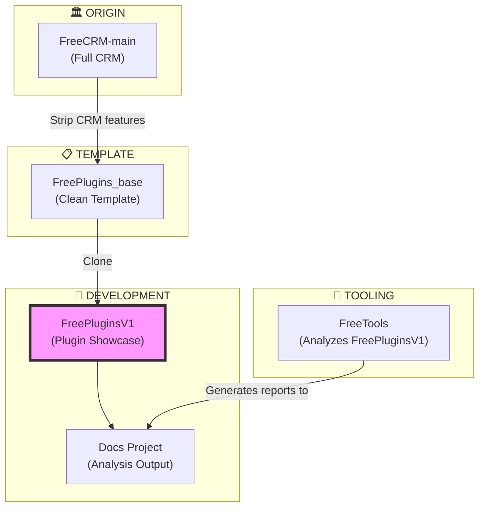

# Deep Dive: FreePluginsV1

> **Suite:** FreePluginsV1 (Development Clone + Plugin Showcase)  
> **Location:** `FreePluginsV1/`  
> **Status:** 🔨 Work in Progress  
> **Projects:** 7 (6 core + Docs)  
> **Last Updated:** 2025-01-XX

---

## Table of Contents

1. [Overview](#overview)
2. [Purpose and Goals](#purpose-and-goals)
3. [Relationship to Other Suites](#relationship-to-other-suites)
4. [Project Structure](#project-structure)
5. [Documentation Project](#documentation-project)
6. [Plugin System](#plugin-system)
7. [Phase 1: Lifecycle Logger Plugin](#phase-1-lifecycle-logger-plugin)
8. [Future Plugin Examples](#future-plugin-examples)
9. [Development Workflow](#development-workflow)

---

## Overview

**FreePluginsV1** is a **development clone** of FreePlugins_base with an additional **Docs project** for documentation and analysis output. It serves as the **primary development environment** for:

- **Plugin development tutorials**
- **Plugin example implementations**
- **Documentation generation**
- **Framework analysis and testing**

### Key Characteristics

| Aspect | Implementation |
|--------|----------------|
| **Purpose** | Plugin development showcase |
| **Base** | Clone of FreePlugins_base |
| **Namespace** | `FreePlugins` |
| **Extra Projects** | Docs (documentation output) |
| **Entity Count** | 13 (same as base) |
| **Unique Feature** | FreeTools integration for analysis |

---

## Purpose and Goals

### Primary Purpose

FreePluginsV1 exists to demonstrate **how to build plugins** for the FreeCRM framework:

1. **Educational** - Step-by-step plugin tutorials
2. **Practical** - Working plugin examples
3. **Portable** - Plugins that work across all suites
4. **Documented** - Comprehensive guides and references

### Project Goals

```
┌─────────────────────────────────────────────────────────────┐
│                 FREEPLUGINSV1 GOALS                         │
├─────────────────────────────────────────────────────────────┤
│                                                             │
│  📋 Phase 1: Application Lifecycle Logger                   │
│     • Log app start/stop events                            │
│     • Output to PluginLogs.log                             │
│     • Drop-in compatible with all suites                   │
│                                                             │
│  📋 Phase 2: Additional Examples                            │
│     • DatabaseHealthCheck plugin                           │
│     • AuditLogger plugin                                   │
│     • CustomAuthProvider plugin                            │
│     • ReportGenerator plugin                               │
│                                                             │
│  📋 Phase 3: Documentation                                  │
│     • Complete plugin development guide                    │
│     • API reference for plugin interfaces                  │
│     • Best practices document                              │
│                                                             │
└─────────────────────────────────────────────────────────────┘
```

---

## Relationship to Other Suites



### Suite Comparison

| Aspect | FreePlugins_base | FreePluginsV1 |
|--------|------------------|---------------|
| **Projects** | 6 | 7 (+Docs) |
| **Purpose** | Template | Development |
| **FreeTools Integration** | No | Yes |
| **Plugin Tutorials** | No | Yes |
| **Documentation** | Minimal | Extensive |

---

## Project Structure

### Standard 6 Projects (Inherited from Base)

```
FreePluginsV1/
├── FreePlugins/                    # Server (ASP.NET Core)
│   ├── Program.cs
│   ├── Controllers/
│   ├── Components/
│   ├── Classes/
│   ├── Hubs/
│   └── Plugins/                    # 📌 Plugin development here
│       ├── Example1.cs
│       ├── Example2.cs
│       ├── Example3.cs
│       ├── ExampleBackgroundProcess.cs
│       ├── LoginWithPrompts.cs
│       ├── UserUpdate.cs
│       └── [NEW PLUGINS HERE]
│
├── FreePlugins.Client/             # Blazor WebAssembly
│   ├── Pages/
│   ├── Shared/
│   └── Layout/
│
├── FreePlugins.DataAccess/         # Business Logic
│   └── DataAccess.*.cs
│
├── FreePlugins.DataObjects/        # DTOs
│   └── DataObjects.*.cs
│
├── FreePlugins.EFModels/           # Entity Framework
│   └── EFModels/
│
└── FreePlugins.Plugins/            # Plugin Engine
    ├── Plugins.cs
    └── Encryption.cs
```

### Additional Docs Project

```
FreePluginsV1/
└── Docs/                           # 📌 NEW: Documentation Project
    ├── Docs.csproj
    ├── README.md
    │
    ├── 000_overview.md
    ├── 001_style_guide.md
    ├── 002_security.md
    ├── 003_shared_code.md
    │
    ├── 101_project-dependency-map.md    # 📌 This series
    ├── 102_deep-dive_FreeCRM-main.md
    ├── 103_deep-dive_FreePlugins_base.md
    ├── 104_deep-dive_FreeGLBA.md
    ├── 105_deep-dive_FreeCICD.md
    ├── 106_deep-dive_FreePluginsV1.md   # 📌 This file
    ├── 107_deep-dive_FreeManager.md
    │
    ├── focusgroup/                      # Focus group reviews
    │
    └── runs/                            # FreeTools output
        └── {Project}/
            └── {Branch}/
                └── latest/
                    ├── {Project}-Report.md
                    ├── pages.csv
                    ├── workspace-inventory.csv
                    └── snapshots/
```

---

## Documentation Project

### Docs.csproj Configuration

```xml
<Project Sdk="Microsoft.NET.Sdk">
  <PropertyGroup>
    <TargetFramework>net10.0</TargetFramework>
    <RootNamespace>FreeTools.Docs</RootNamespace>
    <AssemblyName>FreeTools.Docs</AssemblyName>
    <!-- This project holds generated outputs, not code -->
    <EnableDefaultCompileItems>false</EnableDefaultCompileItems>
  </PropertyGroup>

  <ItemGroup>
    <!-- Include all output files as content -->
    <None Include="runs\**\*" CopyToOutputDirectory="PreserveNewest" />
    <None Include="latest\**\*" CopyToOutputDirectory="PreserveNewest" />
  </ItemGroup>
</Project>
```

### Documentation Categories

| Series | Files | Purpose |
|--------|-------|---------|
| **000-00x** | Overview docs | Architecture, style guide, security |
| **101-1xx** | Deep dives | Per-suite detailed analysis |
| **focusgroup/** | Reviews | Focus group feedback sessions |
| **runs/** | Generated | FreeTools analysis output |

---

## Plugin System

### Current Built-in Plugins

| Plugin | Type | Interface | Status |
|--------|------|-----------|--------|
| `Example1.cs` | General | `IPlugin` | Demo - All prompt types |
| `Example2.cs` | General | `IPlugin` | Demo |
| `Example3.cs` | General | `IPlugin` | Demo |
| `ExampleBackgroundProcess.cs` | Background | `IPluginBackgroundProcess` | Demo |
| `LoginWithPrompts.cs` | Auth | `IPluginAuth` | Demo - Custom login |
| `UserUpdate.cs` | User CRUD | `IPluginUserUpdate` | Demo |

### Plugin Interfaces Available

```csharp
// Base interface - all plugins must implement
public interface IPluginBase
{
    public Dictionary<string, object> Properties();
}

// General purpose plugin
public interface IPlugin : IPluginBase
{
    Task<(bool Result, List<string>? Messages, IEnumerable<object>? Objects)> Execute(
        FreePlugins.DataAccess da,
        Plugins.Plugin plugin,
        FreePlugins.DataObjects.User? currentUser
    );
}

// Authentication plugin
public interface IPluginAuth : IPluginBase
{
    Task<...> Login(DataAccess da, Plugin plugin, string url, Guid tenantId, HttpContext httpContext);
    Task<...> Logout(DataAccess da, Plugin plugin, string url, Guid tenantId, HttpContext httpContext);
}

// Background process plugin
public interface IPluginBackgroundProcess : IPluginBase
{
    Task<...> Execute(DataAccess da, Plugin plugin, long iteration);
}

// User update hook plugin
public interface IPluginUserUpdate : IPluginBase
{
    Task<...> UpdateUser(DataAccess da, Plugin plugin, User? updateUser);
}
```

---

## Phase 1: Lifecycle Logger Plugin

### Specification

The first plugin to be developed for FreePluginsV1 is an **Application Lifecycle Logger**:

```
┌─────────────────────────────────────────────────────────────┐
│  PLUGIN: ApplicationLifecycleLogger                         │
├─────────────────────────────────────────────────────────────┤
│                                                             │
│  Purpose:                                                   │
│    Log application startup and shutdown events              │
│                                                             │
│  Interface:                                                 │
│    IPluginBackgroundProcess (runs on first iteration)       │
│                                                             │
│  Output File:                                               │
│    PluginLogs.log                                           │
│    Location: Same directory as appsettings.json             │
│                                                             │
│  Log Format (CSV):                                          │
│    Timestamp,Event,MachineName,ProcessId,Message            │
│                                                             │
│  Events Logged:                                             │
│    APP_START  - On first background process iteration       │
│    APP_STOP   - On application shutdown (if possible)       │
│    HEARTBEAT  - Optional periodic check (configurable)      │
│                                                             │
└─────────────────────────────────────────────────────────────┘
```

### Implementation Plan

```csharp
// File: FreePlugins/Plugins/ApplicationLifecycleLogger.cs

using FreePlugins;
using Plugins;

namespace LifecyclePlugin
{
    public class ApplicationLifecycleLogger : IPluginBackgroundProcess
    {
        private static bool _startLogged = false;
        private static readonly string LogFile = Path.Combine(
            AppDomain.CurrentDomain.BaseDirectory, 
            "PluginLogs.log"
        );

        public Dictionary<string, object> Properties() =>
            new Dictionary<string, object>
            {
                { "Id", new Guid("11111111-1111-1111-1111-111111111111") },
                { "Author", "EIT Team" },
                { "ContainsSensitiveData", false },
                { "Description", "Logs application lifecycle events" },
                { "Name", "Application Lifecycle Logger" },
                { "SortOrder", -1000 },  // Run first
                { "Type", "BackgroundProcess" },
                { "Version", "1.0.0" }
            };

        public async Task<(bool Result, List<string>? Messages, IEnumerable<object>? Objects)> Execute(
            DataAccess da,
            Plugin plugin,
            long iteration)
        {
            var messages = new List<string>();

            // Log startup on first iteration
            if (!_startLogged)
            {
                _startLogged = true;
                LogEvent("APP_START", "Application started successfully");
                messages.Add("Logged application startup");
            }

            // Optional: heartbeat every N iterations
            // if (iteration % 60 == 0) LogEvent("HEARTBEAT", "Application running");

            return (Result: true, Messages: messages, Objects: null);
        }

        private void LogEvent(string eventType, string message)
        {
            try
            {
                var entry = $"{DateTime.UtcNow:O},{eventType},{Environment.MachineName},{Environment.ProcessId},{message}";
                
                // Create header if file doesn't exist
                if (!File.Exists(LogFile))
                {
                    File.WriteAllText(LogFile, "Timestamp,Event,MachineName,ProcessId,Message\n");
                }
                
                File.AppendAllText(LogFile, entry + "\n");
            }
            catch
            {
                // Swallow errors - logging should never crash the app
            }
        }
    }
}
```

### Expected Output

```csv
Timestamp,Event,MachineName,ProcessId,Message
2025-01-15T10:30:00.0000000Z,APP_START,WEBSERVER01,12345,Application started successfully
2025-01-15T11:30:00.0000000Z,HEARTBEAT,WEBSERVER01,12345,Application running
2025-01-15T18:00:00.0000000Z,APP_STOP,WEBSERVER01,12345,Application shutdown initiated
```

### Portability

Once created, simply copy `ApplicationLifecycleLogger.cs` to any suite's `Plugins/` folder:

```
✅ FreeCRM-main/CRM/Plugins/
✅ FreeCRM-FreePlugins_base/FreePlugins/Plugins/
✅ FreeCICD-main/FreeCICD/Plugins/
✅ FreeGLBA-main/FreeGLBA/Plugins/
✅ FreeManager-main/FreeManager/Plugins/
```

**Note:** Update the namespace in the `using` statement to match the target suite:
- `using CRM;` for FreeCRM
- `using FreePlugins;` for FreePlugins_base
- `using FreeCICD;` for FreeCICD
- etc.

---

## Future Plugin Examples

### Phase 2 Plugins

| Plugin | Interface | Purpose |
|--------|-----------|---------|
| **DatabaseHealthCheck** | `IPluginBackgroundProcess` | Periodic DB connectivity test |
| **AuditLogger** | `IPluginUserUpdate` | Log all user CRUD operations |
| **CustomAuthProvider** | `IPluginAuth` | Template for SSO integration |
| **ReportGenerator** | `IPlugin` | PDF/CSV export framework |

### Phase 3 Documentation

| Document | Content |
|----------|---------|
| **Plugin Development Guide** | Step-by-step tutorial |
| **Plugin API Reference** | Interface documentation |
| **Plugin Best Practices** | Common patterns and pitfalls |
| **Plugin Testing Guide** | How to test plugins |

---

## Development Workflow

### Setting Up FreePluginsV1

```bash
# 1. Clone the repository
git clone https://github.com/WSU-EIT/FreePlugins.git

# 2. Navigate to FreePluginsV1
cd FreePlugins/FreePluginsV1

# 3. Run the application
dotnet run --project FreePlugins/FreePlugins.csproj
```

### Creating a New Plugin

1. **Create the file** in `FreePlugins/Plugins/`:
   ```
   FreePlugins/Plugins/MyNewPlugin.cs
   ```

2. **Implement the interface**:
   ```csharp
   using FreePlugins;
   using Plugins;
   
   namespace MyPluginNamespace
   {
       public class MyNewPlugin : IPlugin
       {
           public Dictionary<string, object> Properties() => ...;
           public async Task<...> Execute(...) => ...;
       }
   }
   ```

3. **Test** by running the application and accessing the Plugin Testing page

4. **Document** the plugin in the Docs folder

### Running FreeTools Analysis

```bash
# From the FreeTools directory
cd FreePlugins/FreeTools
dotnet run --project FreeTools.AppHost

# Output will be in FreePluginsV1/Docs/runs/
```

---

## Summary

**FreePluginsV1** is the **development and documentation hub** for the FreeCRM plugin system:

| Aspect | Purpose |
|--------|---------|
| **Base Code** | Clean FreePlugins_base clone |
| **Plugins Folder** | Plugin development area |
| **Docs Project** | Documentation and analysis output |
| **FreeTools Target** | Primary analysis target |

### Current Status

| Component | Status |
|-----------|--------|
| Base Framework | ✅ Complete |
| Docs Project | ✅ Complete |
| Built-in Plugins | ✅ Complete |
| Lifecycle Logger | 🔨 In Development |
| Documentation Series | 🔨 In Progress |
| Phase 2 Plugins | 📋 Planned |

### Next Steps

1. ✅ Complete documentation deep dives (101-107)
2. 🔨 Implement ApplicationLifecycleLogger plugin
3. 📋 Test portability across suites
4. 📋 Create plugin development guide
5. 📋 Implement Phase 2 plugins

---

## 📬 About

**FreePluginsV1** is developed and maintained by **[Enrollment Information Technology (EIT)](https://em.wsu.edu/eit/meet-our-staff/)** at **Washington State University**.

📧 Questions or feedback? Visit our [team page](https://em.wsu.edu/eit/meet-our-staff/)
