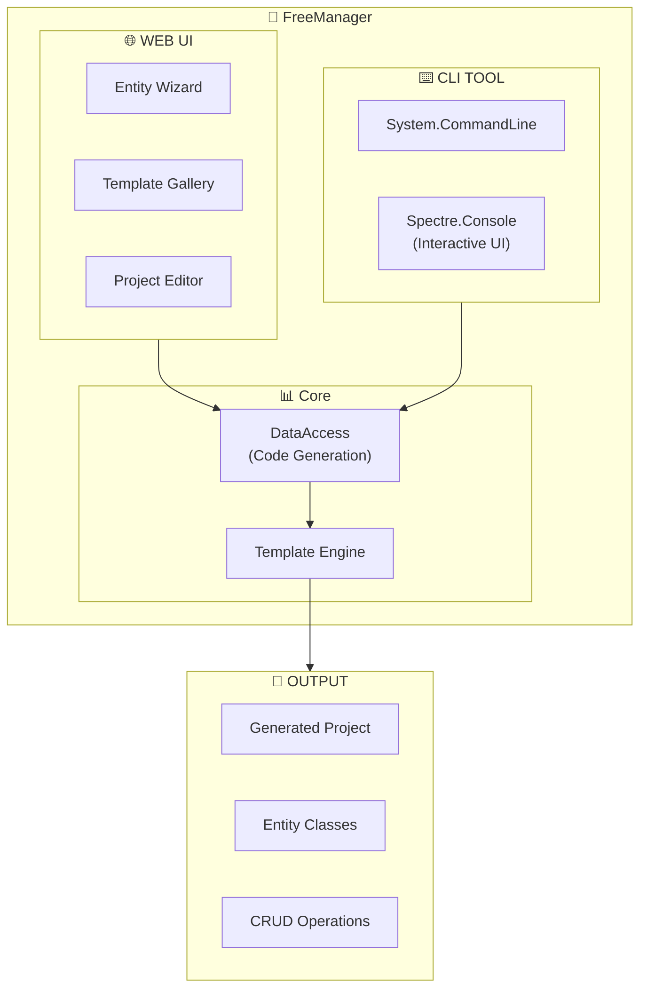

# Deep Dive: FreeManager-main

> **Suite:** FreeManager-main (Management Tool - Oldest Implementation)  
> **Location:** `FreeManager-main/`  
> **Status:** ✅ Active (Legacy)  
> **Projects:** 7 (6 core + CLI)  
> **Last Updated:** 2025-01-XX

---

## Table of Contents

1. [Overview](#overview)
2. [Architecture Diagram](#architecture-diagram)
3. [What Makes FreeManager Unique](#what-makes-freemanager-unique)
4. [Project Structure](#project-structure)
5. [CLI Tool](#cli-tool)
6. [Entity Wizard](#entity-wizard)
7. [Template System](#template-system)
8. [Plugin System](#plugin-system)
9. [Razor Component Patterns](#razor-component-patterns)
10. [Version Notes](#version-notes)

---

## Overview

**FreeManager** is a **project scaffolding and code generation tool** built on the FreeCRM framework. It was the **first implementation** derived from FreeCRM and served as a **prototype** to help design patterns used in later suites like FreeGLBA.

### Key Characteristics

| Aspect | Implementation |
|--------|----------------|
| **Purpose** | Code generation and project scaffolding |
| **Namespace** | `FreeManager` |
| **Extra Projects** | CLI tool (System.CommandLine + Spectre.Console) |
| **UI Feature** | Entity wizard with live code preview |
| **Status** | Oldest suite, good for Razor pattern ideas |

### Historical Significance

FreeManager pioneered several patterns now used across all suites:
- **Wizard UI pattern** (later refined in FreeCICD)
- **Code generation** from entity definitions
- **CLI companion tool** pattern
- **Template gallery** concept

---

## Architecture Diagram



---

## What Makes FreeManager Unique

### Compared to Other Suites

| Feature | FreePlugins_base | FreeManager |
|---------|------------------|-------------|
| **Projects** | 6 | 7 (+CLI) |
| **Purpose** | Template | Code generation |
| **CLI Tool** | ❌ | ✅ Full CLI |
| **Entity Wizard** | ❌ | ✅ Multi-step |
| **Code Preview** | ❌ | ✅ Live preview |
| **Template Gallery** | ❌ | ✅ Reusable templates |

### Additional Project: FreeManager.Cli

| Package | Purpose |
|---------|---------|
| `System.CommandLine` | Command-line parsing |
| `Spectre.Console` | Rich console UI |

---

## Project Structure

### FreeManager-Specific Files

```
FreeManager-main/
├── FreeManager/
│   └── Controllers/
│       └── FreeManager.App.DataController.cs    # Generation endpoints
│
├── FreeManager.Client/
│   ├── Pages/
│   │   ├── FreeManager.App.EntityDashboard.razor
│   │   ├── FreeManager.App.EntityWizard.razor
│   │   ├── FreeManager.App.SetupWizardBuilder.razor
│   │   ├── FreeManager.App.TemplateGallery.razor
│   │   ├── FreeManager.App.Templates.razor
│   │   └── FreeManager.App.TemplateSetup.razor
│   │
│   └── Shared/
│       ├── AppComponents/
│       │   ├── FreeManager.App.NewProject.razor
│       │   ├── FreeManager.App.ProjectEditor.razor
│       │   └── FreeManager.App.Projects.razor
│       │
│       └── Wizard/                              # 📌 Extensive wizard components
│           ├── FreeManager.App.EntityWizardCodeEditor.razor
│           ├── FreeManager.App.EntityWizardEntitiesOverview.razor
│           ├── FreeManager.App.EntityWizardEntityCard.razor
│           ├── FreeManager.App.EntityWizardEnumEditor.razor
│           ├── FreeManager.App.EntityWizardImportModal.razor
│           ├── FreeManager.App.EntityWizardLivePreview.razor
│           ├── FreeManager.App.EntityWizardPropertyEditor.razor
│           ├── FreeManager.App.EntityWizardQuickStart.razor
│           ├── FreeManager.App.EntityWizardRelationshipEditor.razor
│           ├── FreeManager.App.EntityWizardSmartSuggestion.razor
│           ├── FreeManager.App.EntityWizardStatsWidget.razor
│           ├── FreeManager.App.EntityWizardStepComplete.razor
│           ├── FreeManager.App.EntityWizardStepEntity.razor
│           ├── FreeManager.App.EntityWizardStepHeader.razor
│           ├── FreeManager.App.EntityWizardStepOptions.razor
│           ├── FreeManager.App.EntityWizardStepper.razor
│           ├── FreeManager.App.EntityWizardStepPreview.razor
│           ├── FreeManager.App.EntityWizardStepProject.razor
│           ├── FreeManager.App.EntityWizardStepProperties.razor
│           ├── FreeManager.App.EntityWizardSummary.razor
│           ├── FreeManager.App.EntityWizardTemplateManager.razor
│           └── FreeManager.App.EntityWizardTypePicker.razor
│
├── FreeManager.DataAccess/
│   ├── FreeManager.App.DataAccess.CodeGeneration.cs
│   ├── FreeManager.App.DataAccess.cs
│   ├── FreeManager.App.DataAccess.FileOperations.cs
│   └── FreeManager.App.DataAccess.Projects.cs
│
├── FreeManager.DataObjects/
│   ├── FreeManager.App.DataObjects.ApplicationTemplates.cs
│   ├── FreeManager.App.DataObjects.cs
│   ├── FreeManager.App.DataObjects.Endpoints.cs
│   ├── FreeManager.App.DataObjects.EntityWizard.cs    # 📌 20+ DTOs
│   ├── FreeManager.App.DataObjects.Gallery.cs
│   ├── FreeManager.App.DataObjects.Persistence.cs
│   ├── FreeManager.App.DataObjects.Projects.cs
│   ├── FreeManager.App.DataObjects.SmartHelpers.cs
│   └── FreeManager.App.DataObjects.Templates.cs
│
├── FreeManager.EFModels/
│   └── EFModels/
│       ├── FreeManager.App.EFDataModel.cs
│       ├── FreeManager.App.FMAppFile.cs
│       ├── FreeManager.App.FMAppFileVersion.cs
│       ├── FreeManager.App.FMBuild.cs
│       └── FreeManager.App.FMProject.cs
│
└── FreeManager.Cli/                              # 📌 CLI Tool
    ├── FreeManager.Cli.csproj
    ├── Program.cs
    ├── MenuService.cs
    └── TemplateService.cs
```

---

## CLI Tool

### Usage

```bash
# Interactive menu (no arguments)
FreeManager.exe

# Create simple project
FreeManager.exe new MyProject --template Starter

# Create full application from template
FreeManager.exe app FreeGLBA --template FreeAudit

# List available templates
FreeManager.exe list

# Show help
FreeManager.exe help
```

### Simple Templates

| Template | Description |
|----------|-------------|
| `Empty` | Minimal project structure |
| `Skeleton` | Basic structure with placeholder files |
| `Starter` | Common starting point (default) |
| `FullCrud` | Complete CRUD operations |

### Application Templates

| Template | Description |
|----------|-------------|
| `FreeBase` | Clean starting point |
| `FreeTracker` | Tracking/logging application |
| `FreeAudit` | Audit/compliance application (like FreeGLBA) |

### CLI Implementation

```csharp
// Program.cs - Using System.CommandLine
var rootCommand = new RootCommand("FreeManager CLI - FreeCRM Project Generator");

var newCommand = new Command("new", "Create a new project from a simple template");
var nameArgument = new Argument<string>("name", "Project name");
var templateOption = new Option<string>(
    aliases: ["--template", "-t"],
    getDefaultValue: () => "Starter");

newCommand.AddArgument(nameArgument);
newCommand.AddOption(templateOption);

newCommand.SetHandler(async (name, template, output) =>
{
    await CreateProject(name, template, output);
}, nameArgument, templateOption, outputOption);
```

### Spectre.Console Integration

```csharp
// Rich interactive menus
var selection = AnsiConsole.Prompt(
    new SelectionPrompt<string>()
        .Title("What would you like to do?")
        .AddChoices(new[] {
            "Create new project",
            "Create application from template",
            "List templates",
            "Exit"
        }));
```

---

## Entity Wizard

### Wizard State

```csharp
public class EntityWizardState
{
    public int CurrentStep { get; set; }
    public FMCreateProjectRequest Project { get; set; }
    
    // Multi-entity support
    public List<EntityDefinition> Entities { get; set; }
    public List<RelationshipDefinition> Relationships { get; set; }
    public int? SelectedEntityIndex { get; set; }
    
    public EntityWizardOptions Options { get; set; }
    public List<GeneratedFileInfo> GeneratedFiles { get; set; }
}
```

### Entity Definition

```csharp
public class EntityDefinition
{
    public string Name { get; set; }
    public string TableName { get; set; }
    public string Description { get; set; }
    public string PrimaryKeyName { get; set; }
    public string PrimaryKeyType { get; set; }  // Guid, int, string
    
    public List<PropertyDefinition> Properties { get; set; }
    public List<EnumTypeDefinition> CustomEnums { get; set; }
}
```

### Property Definition

```csharp
public class PropertyDefinition
{
    public string Name { get; set; }
    public string Type { get; set; }
    public string Description { get; set; }
    public bool IsRequired { get; set; }
    public bool IsNullable { get; set; }
    public int? MaxLength { get; set; }
    
    // UI hints
    public string DisplayName { get; set; }
    public string Placeholder { get; set; }
    public string InputType { get; set; }
    
    // Validation
    public string ValidationRegex { get; set; }
    public string ValidationMessage { get; set; }
}
```

### Wizard Steps

| Step | Component | Purpose |
|------|-----------|---------|
| 1 | `StepProject.razor` | Project name and namespace |
| 2 | `StepEntity.razor` | Entity definition |
| 3 | `StepProperties.razor` | Property definitions |
| 4 | `StepOptions.razor` | Generation options |
| 5 | `StepPreview.razor` | Code preview |
| 6 | `StepComplete.razor` | Generation complete |

### Wizard Components (22 Total)

| Component | Purpose |
|-----------|---------|
| `Stepper.razor` | Step navigation |
| `StepHeader.razor` | Current step title |
| `EntitiesOverview.razor` | Multi-entity list |
| `EntityCard.razor` | Entity summary card |
| `PropertyEditor.razor` | Property form |
| `EnumEditor.razor` | Custom enum definition |
| `RelationshipEditor.razor` | FK relationships |
| `TypePicker.razor` | Type selection |
| `LivePreview.razor` | Real-time code preview |
| `CodeEditor.razor` | Monaco editor |
| `SmartSuggestion.razor` | AI suggestions |
| `TemplateManager.razor` | Save/load templates |
| `ImportModal.razor` | Import existing |
| `QuickStart.razor` | Common patterns |
| `StatsWidget.razor` | Progress stats |
| `Summary.razor` | Final summary |

---

## Template System

### Template Types

```csharp
public class SavedEntityTemplate
{
    public Guid TemplateId { get; set; }
    public string Name { get; set; }
    public string Description { get; set; }
    public string Category { get; set; }
    public EntityDefinition Entity { get; set; }
    public DateTime CreatedAt { get; set; }
}

public class SavedWizardStateTemplate
{
    public Guid TemplateId { get; set; }
    public string Name { get; set; }
    public string Description { get; set; }
    public EntityWizardState State { get; set; }
    public DateTime CreatedAt { get; set; }
}
```

### Built-in Templates

| Category | Templates |
|----------|-----------|
| **Simple Entity** | User, Product, Order, Category |
| **Tracking** | AuditLog, ChangeHistory, Event |
| **Compliance** | AccessEvent, DataSubject, Report |
| **Project** | FreeBase, FreeTracker, FreeAudit |

---

## Plugin System

### Plugin Status

FreeManager includes **all standard plugins**:

| Plugin | File | Status |
|--------|------|--------|
| `Example1.cs` | `Example1.cs` | ✅ Demo |
| `Example2.cs` | `Example2.cs` | ✅ Demo |
| `Example3.cs` | `Example3.cs` | ✅ Demo |
| `ExampleBackgroundProcess.cs` | `ExampleBackgroundProcess.cs` | ✅ Demo |
| `LoginWithPrompts.cs` | `LoginWithPrompts.cs` | ✅ Demo |
| `UserUpdate.cs` | `UserUpdate.cs` | ✅ Demo |

### Namespace for Plugins

```csharp
using FreeManager;

public class MyPlugin : IPlugin
{
    public async Task<...> Execute(
        FreeManager.DataAccess da,
        Plugins.Plugin plugin,
        FreeManager.DataObjects.User? currentUser)
    { }
}
```

---

## Razor Component Patterns

FreeManager is a **rich source of Razor component patterns** due to its complex wizard UI.

### Pattern 1: Nested Wizard Components

```razor
@* Main wizard container *@
<div class="entity-wizard">
    <FreeManager_App_EntityWizardStepper CurrentStep="@State.CurrentStep" />
    
    @switch (State.CurrentStep)
    {
        case 1:
            <FreeManager_App_EntityWizardStepProject 
                State="@State" 
                OnNext="@HandleNext" />
            break;
        case 2:
            <FreeManager_App_EntityWizardStepEntity
                State="@State"
                OnNext="@HandleNext"
                OnBack="@HandleBack" />
            break;
        // ... more steps
    }
</div>
```

### Pattern 2: Live Code Preview

```razor
<div class="preview-container">
    <div class="preview-tabs">
        @foreach (var file in GeneratedFiles)
        {
            <button class="@(SelectedFile == file.Name ? "active" : "")"
                    @onclick="() => SelectFile(file.Name)">
                @file.Name
            </button>
        }
    </div>
    
    <FreeManager_App_EntityWizardCodeEditor
        Code="@SelectedFile?.Content"
        Language="@GetLanguage(SelectedFile)"
        ReadOnly="true" />
</div>
```

### Pattern 3: Property Editor with Dynamic Types

```razor
@foreach (var prop in Entity.Properties)
{
    <div class="property-row">
        <input @bind="prop.Name" placeholder="Property name" />
        
        <FreeManager_App_EntityWizardTypePicker
            @bind-Value="prop.Type"
            AvailableTypes="@AvailableTypes"
            CustomEnums="@Entity.CustomEnums" />
        
        <div class="options">
            <input type="checkbox" @bind="prop.IsRequired" /> Required
            <input type="checkbox" @bind="prop.IsNullable" /> Nullable
        </div>
        
        <button @onclick="() => RemoveProperty(prop)">
            <Icon Name="trash" />
        </button>
    </div>
}
```

### Pattern 4: Smart Suggestions

```razor
<FreeManager_App_EntityWizardSmartSuggestion
    EntityName="@Entity.Name"
    CurrentProperties="@Entity.Properties"
    OnSuggestionAccepted="@AddSuggestedProperty" />

@code {
    private void AddSuggestedProperty(PropertyDefinition suggested)
    {
        Entity.Properties.Add(suggested);
        StateHasChanged();
    }
}
```

### Pattern 5: Stats Widget

```razor
<div class="stats-widget">
    <div class="stat">
        <span class="value">@State.Entities.Count</span>
        <span class="label">Entities</span>
    </div>
    <div class="stat">
        <span class="value">@TotalProperties</span>
        <span class="label">Properties</span>
    </div>
    <div class="stat">
        <span class="value">@State.Relationships.Count</span>
        <span class="label">Relationships</span>
    </div>
    <div class="stat">
        <span class="value">@EstimatedFiles</span>
        <span class="label">Files to Generate</span>
    </div>
</div>
```

---

## Version Notes

### Package Version Drift

⚠️ **FreeManager has slightly older packages than the newest suites:**

| Package | FreeManager | Latest |
|---------|-------------|--------|
| `Radzen.Blazor` | 8.4.0 | 8.5.0 |
| `Microsoft.Graph` | 5.98.0 | 5.100.0 |
| `QuestPDF` | 2025.12.0 | 2025.12.1 |

### Legacy Patterns

Some patterns in FreeManager are **older designs** that have been refined:

| Old Pattern (FreeManager) | New Pattern (FreeGLBA/FreeCICD) |
|---------------------------|--------------------------------|
| Complex nested components | Flatter component hierarchy |
| Large state objects | Smaller focused DTOs |
| Inline validation | Attribute-based validation |

---

## Summary

**FreeManager** is valuable as:

1. **Historical reference** - First implementation patterns
2. **Razor component examples** - Rich wizard UI
3. **CLI tool pattern** - System.CommandLine + Spectre.Console
4. **Template system** - Reusable project templates

### Key Takeaways for FreePluginsV1

| Pattern | Learn From |
|---------|------------|
| **Wizard UI** | 22-component wizard architecture |
| **Live Preview** | Real-time code generation preview |
| **CLI Tool** | System.CommandLine + Spectre.Console |
| **State Management** | EntityWizardState container |
| **Smart Suggestions** | AI-assisted property suggestions |

### When to Reference FreeManager

✅ **Use for:**
- Complex wizard UI patterns
- CLI tool implementation
- Code generation ideas
- Template management patterns

❌ **Prefer newer suites for:**
- Modern package versions
- API design patterns
- NuGet publishing patterns

---

## 📬 About

**FreeManager** is developed and maintained by **[Enrollment Information Technology (EIT)](https://em.wsu.edu/eit/meet-our-staff/)** at **Washington State University**.

📧 Questions or feedback? Visit our [team page](https://em.wsu.edu/eit/meet-our-staff/)
